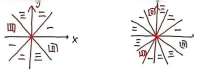
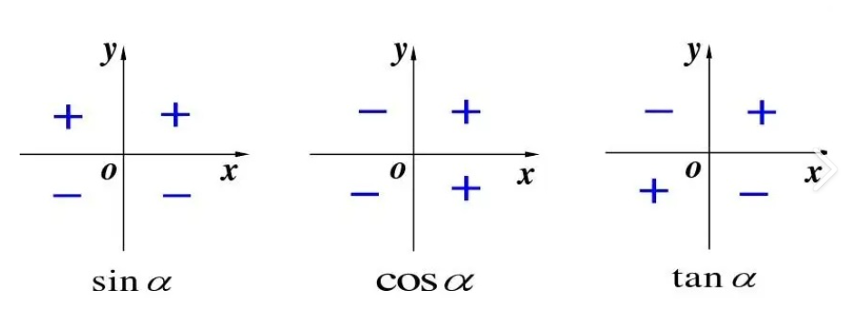
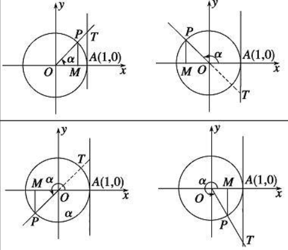

## 高中数学三角函数知识点留档

首先感谢我的数学老师

### 【清单01】任意角、弧度制

#### 一、角的概念

角可以看成平面内一条**射线**绕着它的端点**旋转**所成的图形

#### 二、角的分类

| 分类依据 | 具体类型 |
| --- | --- |
| 按旋转方向 | 按逆时针方向旋转形成的角：**正角** 按顺时针方向旋转形成的角：**负角** 不做任何旋转形成的角：**零角** |
| 按终边位置：象限角与轴线角 | 把角放在平面直角坐标系中，使角的顶点与**原点**重合，角的始边与**x轴的非负半轴**重合，那么，角的终边在第几象限，就说这个角是第几**象限角**。 如果角的终边在坐标轴上，就认为这个角不属于任何一个象限，是**轴线角** |

##### 象限角集合（弧度制）

| 象限角 | 角的集合用弧度制表示 |
| --- | --- |
| 第一象限角 | $\{\alpha \mid 2k\pi < \alpha < \frac{\pi}{2}+2k\pi,\;k\in\mathbb{Z}\}$ |
| 第二象限角 | $\{\alpha \mid \frac{\pi}{2}+2k\pi < \alpha < \pi+2k\pi,\;k\in\mathbb{Z}\}$ |
| 第三象限角 | $\{\alpha \mid \pi+2k\pi < \alpha < \frac{3\pi}{2}+2k\pi,\;k\in\mathbb{Z}\}$ |
| 第四象限角 | $\{\alpha \mid \frac{3\pi}{2}+2k\pi < \alpha < 2\pi+2k\pi,\;k\in\mathbb{Z}\}$ |

:::note
第四象限角也可以写成：$\{\alpha \mid -\frac{\pi}{2}+2k\pi < \alpha < 2k\pi,\;k\in\mathbb{Z}\}$
:::

##### 轴线角集合

| 角的终边的位置 | 角的集合表示 |
| --- | --- |
| 终边落在$x$轴的非负半轴上 | $\{\alpha \mid \alpha=2k\pi,\;k\in\mathbb{Z}\}$ |
| 终边落在$x$轴的非正半轴上 | $\{\alpha \mid \alpha=\pi+2k\pi,\;k\in\mathbb{Z}\}$ |
| 终边落在$x$轴上 | $\{\alpha \mid \alpha=k\pi,\;k\in\mathbb{Z}\}$ |
| 终边落在$y$轴的非负半轴上 | $\{\alpha \mid \alpha=\frac{\pi}{2}+2k\pi,\;k\in\mathbb{Z}\}$ |
| 终边落在$y$轴的非正半轴上 | $\{\alpha \mid \alpha=\frac{3\pi}{2}+2k\pi,\;k\in\mathbb{Z}\}$ |
| 终边落在$y$轴上 | $\{\alpha \mid \alpha=\frac{\pi}{2}+k\pi,\;k\in\mathbb{Z}\}$ |
| 终边落在坐标轴上 | $\{\alpha \mid \alpha=\frac{k\pi}{2},\;k\in\mathbb{Z}\}$ |

#### 三、终边相同的角

所有与角$\alpha$终边相同的角，连同角$\alpha$在内，可构成一个集合
$S=\{\boldsymbol{\beta \mid \beta=\alpha+2k\pi,\;k\in\mathbb{Z}}\}$

- 终边相同的角的集合：$\alpha+2k\pi,\;k\in\mathbb{Z}$
- 终边在一条直线上的角的集合：$\alpha+k\pi,\;k\in\mathbb{Z}$
- 终边相互垂直的角的集合：$\alpha+\frac{k\pi}{2},\;k\in\mathbb{Z}$

:::important

- 区分：锐角，小于90°的角，第一象限角
- 钟表走过的角都是**负角**
- 判断角所在的象限：**化正，化小，化锐**
- 终边共直线，加上 $k\pi$ ；终边共射线，加上 $2k\pi$

:::

#### 四、弧度制

(1) 定义：以弧度作为单位来度量角的单位制

(2) 1弧度的角：长度等于**半径**的圆弧所对的圆心角，记作 **1 rad**,**rad** 可省略不写

#### 五、角度与弧度的互化

$180^\circ=\boldsymbol{\pi}\ \text{rad}$

$1^\circ=\boldsymbol{\frac{\pi}{180}}\ \text{rad} \approx 0.01745\ \text{rad}$

$1\ \text{rad}=\left(\frac{180}{\pi}\right)^\circ \approx \boldsymbol{57.3^\circ}$

#### 六、弧度制下的弧长与扇形面积公式

设扇形的半径为$R$，弧长为$l$，$\alpha(0<\alpha<2\pi)$为其圆心角

则

(1) 弧长公式：$l=\boldsymbol{\alpha \cdot R}$

(2) 扇形面积公式：$S=\boldsymbol{\frac{1}{2} l \cdot R} = \boldsymbol{\frac{1}{2} \alpha \cdot R^2}$

:::warning
角度与弧度不能混用。
:::

#### 七、$\boldsymbol{\frac{\alpha}{n}}$ 终边所在象限

| $\alpha$ | 第一象限 | 第二象限 | 第三象限 | 第四象限 |
| --- | --- | --- | --- | --- |
| $\frac{\alpha}{2}$ | 一、三 | 一、三 | 二、四 | 二、四 |
| $\frac{\alpha}{3}$ | 一、二、三 | 一、二、四 | 一、三、四 | 二、三、四 |

---

### 【清单02】三角函数的概念

#### 一、任意角的三角函数的定义

1. 设$\alpha$是一个任意角，$\alpha \in \mathbb{R}$，它的终边$OP$与单位圆相交于点$P(x,y)$

则

$\sin\alpha = \boldsymbol{y}$；$\cos\alpha = \boldsymbol{x}$；$\tan\alpha = \boldsymbol{\frac{y}{x}}\;(x \neq 0)$

2. 定义的推广：

设$\alpha$是一个任意角，它的终边上任意一点$P$（不与原点$O$重合）的坐标为$(x,y)$，点$P$与原点的距离为$r$，则：

$\sin\alpha = \boldsymbol{\frac{y}{r}}$；$\cos\alpha = \boldsymbol{\frac{x}{r}}$；$\tan\alpha = \boldsymbol{\frac{y}{x}}\;(x \neq 0)$

$\sec\alpha = \boldsymbol{\frac{r}{x}}$；$\csc\alpha = \boldsymbol{\frac{r}{y}}$；$\cot\alpha = \boldsymbol{\frac{x}{y}}$

:::note

- $r=\sqrt{x^2+y^2}$
- 三角函数值与**终边上点的位置无关**，与**终边的位置有关**

:::

3. 当$0 < \alpha < \frac{\pi}{2}$时，$\sin\alpha < \alpha < \tan\alpha$

#### 二、正弦、余弦、正切函数值在各象限内的符号

1. $\sin\alpha > 0$时，$\alpha$终边所在位置：**第一、二象限及$y$轴的非负半轴**

$\cos\alpha > 0$时，$\alpha$终边所在位置：**第一、四象限及$x$轴的非负半轴**

$\tan\alpha > 0$时，$\alpha$终边所在位置：**第一、三象限**

:::note
类似“才”字。

:::

2. $\sin\alpha - \cos\alpha > 0$时，$\alpha$终边所在位置：**$y=x$直线上方**

$\sin\alpha + \cos\alpha > 0$时，$\alpha$终边所在位置：**$y=-x$直线上方**

证明：

- $\sin\alpha + \cos\alpha = \sqrt{2}\sin\left(\alpha+\frac{\pi}{4}\right) > 0 \implies \sin\left(\alpha+\frac{\pi}{4}\right) > 0$
  $\implies 2k\pi < \alpha+\frac{\pi}{4} < \pi+2k\pi \implies -\frac{\pi}{4}+2k\pi < \alpha < \frac{3\pi}{4}+2k\pi,\;k\in\mathbb{Z}$
- $\sin\alpha - \cos\alpha = \sqrt{2}\sin\left(\alpha-\frac{\pi}{4}\right) > 0 \implies \sin\left(\alpha-\frac{\pi}{4}\right) > 0$
  $\implies 2k\pi < \alpha-\frac{\pi}{4} < \pi+2k\pi \implies \frac{\pi}{4}+2k\pi < \alpha < \frac{5\pi}{4}+2k\pi,\;k\in\mathbb{Z}$

3. 三角函数线

描述：设任意角$\alpha$的终边与单位圆交于$P$，过$P$作$x$轴的垂线，垂足为$M$，则有向线段 $OM$为$\alpha$的余弦线，有向线段 $MP$为$\alpha$的正弦线。

设单位圆交$x$轴正半轴于$A$，过$A$作单位圆的切线，$\alpha$的终边或其延长线交切线于$T$，则有向线段 $AT$为$\alpha$的正切线。

**※ 当 $x \in \left(0,\;\frac{\pi}{2}\right)$ 时**：

$\sin x < x < \tan x$

$0 < 1-\cos x < \frac{x^2}{2}$

#### 三、特殊角的三角函数值

| 弧度 | $0$ | $\frac{\pi}{6}$ | $\frac{\pi}{4}$ | $\frac{\pi}{3}$ | $\frac{\pi}{2}$ | $\frac{2\pi}{3}$ | $\frac{3\pi}{4}$ | $\frac{5\pi}{6}$ | $\pi$ | $\frac{7\pi}{12}$ | $\frac{5\pi}{12}$ |
| --- | --- | --- | --- | --- | --- | --- | --- | --- | --- | --- | --- |
| $\sin\alpha$ | $0$ | $\frac{1}{2}$ | $\frac{\sqrt{2}}{2}$ | $\frac{\sqrt{3}}{2}$ | $1$ | $\frac{\sqrt{3}}{2}$ | $\frac{\sqrt{2}}{2}$ | $\frac{1}{2}$ | $0$ | $\frac{\sqrt{6}+\sqrt{2}}{4}$ | $\frac{\sqrt{6}+\sqrt{2}}{4}$ |
| $\cos\alpha$ | $1$ | $\frac{\sqrt{3}}{2}$ | $\frac{\sqrt{2}}{2}$ | $\frac{1}{2}$ | $0$ | $-\frac{1}{2}$ | $-\frac{\sqrt{2}}{2}$ | $-\frac{\sqrt{3}}{2}$ | $-1$ | $\frac{\sqrt{2}-\sqrt{6}}{4}$ | $\frac{\sqrt{6}-\sqrt{2}}{4}$ |
| $\tan\alpha$ | $0$ | $\frac{\sqrt{3}}{3}$ | $1$ | $\sqrt{3}$ | 不存在 | $-\sqrt{3}$ | $-1$ | $-\frac{\sqrt{3}}{3}$ | $0$ | $2-\sqrt{3}$ | $2+\sqrt{3}$ |

#### 四、同角三角函数的基本关系式

1. 平方关系：
$\boldsymbol{\sin^2\alpha + \cos^2\alpha = 1}$、$\boldsymbol{1+\tan^2\alpha = \sec^2\alpha}$、$\boldsymbol{1+\cot^2\alpha = \csc^2\alpha}$

2. 商数关系：
$\boldsymbol{\tan\alpha = \frac{\sin\alpha}{\cos\alpha}\;\left(\alpha \neq \frac{\pi}{2}+k\pi,\;k\in\mathbb{Z}\right)}$

$\sec\alpha = \boldsymbol{\frac{1}{\cos\alpha}}$、$\csc\alpha = \boldsymbol{\frac{1}{\sin\alpha}}$

常见变形：
① $(\sin\theta \pm \cos\theta)^2 = 1 \pm 2\sin\theta\cos\theta = 1 \pm \sin2\theta$

② $\sin^4\theta + \cos^4\theta = (\sin^2\theta+\cos^2\theta)^2 - 2\sin^2\theta\cos^2\theta = 1 - \frac{1}{2}\sin^22\theta$

③ $(\sin\alpha + \cos\alpha)^2 + (\sin\alpha - \cos\alpha)^2 = 2$

#### 五、诱导公式口诀

**奇变偶不变，符号看象限。**
:::note

- 奇偶指的是 $\frac{\pi}{2}$ 的倍数
- 符号是看**变形前三角函数**所在象限正负
- 不论 $\alpha$ 为多少，都看作正角

:::
:::tip
熟记:

- $\sin(-\alpha) = -\sin\alpha$
- $\cos(-\alpha) = \cos\alpha$
- $\tan(-\alpha) = -\tan\alpha$
- $\sin(\pi - \alpha) = \sin\alpha$
- $\cos(\pi - \alpha) = -\cos\alpha$
- $\sin(\frac{\pi}{2} \pm \alpha) = \cos\alpha$

:::
---

### 【清单03】三角恒等变换

#### ①和与差公式

$$
\begin{cases}
\sin(\alpha \pm \beta) = \sin\alpha\cos\beta \pm \cos\alpha\sin\beta \\
\cos(\alpha \pm \beta) = \cos\alpha\cos\beta \mp \sin\alpha\sin\beta \\
\tan(\alpha + \beta) = \dfrac{\tan\alpha + \tan\beta}{1 - \tan\alpha\tan\beta} \\
\tan(\alpha - \beta) = \dfrac{\tan\alpha - \tan\beta}{1 + \tan\alpha\tan\beta}
\end{cases}
$$

变形：
$\tan\alpha + \tan\beta = \tan(\alpha+\beta) - \tan\alpha\tan\beta\tan(\alpha+\beta) = \tan(\alpha+\beta)(1 - \tan\alpha\tan\beta)$

#### ②倍角公式

$$
\begin{cases}
\sin2\alpha = \boldsymbol{2\sin\alpha\cos\alpha} \\
\cos2\alpha = \boldsymbol{\cos^2\alpha - \sin^2\alpha = 2\cos^2\alpha - 1 = 1 - 2\sin^2\alpha} \\
\tan2\alpha = \boldsymbol{\dfrac{2\tan\alpha}{1 - \tan^2\alpha}}
\end{cases}
$$

#### ③降幂公式

$\cos^2\alpha = \boldsymbol{\dfrac{1+\cos2\alpha}{2}}$

$\sin^2\alpha = \boldsymbol{\dfrac{1-\cos2\alpha}{2}}$

#### ④升幂公式

$(1+\sin2\alpha) = \boldsymbol{(\sin\alpha+\cos\alpha)^2}$，$1-\sin2\alpha = \boldsymbol{(\sin\alpha-\cos\alpha)^2}$

$1+\cos2\alpha = \boldsymbol{2\cos^2\alpha}$，$1-\cos2\alpha = \boldsymbol{2\sin^2\alpha}$

#### ⑤半角公式

$$
\begin{cases}
\sin\dfrac{\alpha}{2} = \pm\sqrt{\dfrac{1-\cos\alpha}{2}},\; \cos\dfrac{\alpha}{2} = \pm\sqrt{\dfrac{1+\cos\alpha}{2}} \\
\tan\dfrac{\alpha}{2} = \pm\sqrt{\dfrac{1-\cos\alpha}{1+\cos\alpha}} = \boldsymbol{\dfrac{\sin\alpha}{1+\cos\alpha}} = \boldsymbol{\dfrac{1-\cos\alpha}{\sin\alpha}}
\end{cases}
$$

#### ⑥积化和差

$$
\begin{cases}
\sin\alpha\cos\beta = \dfrac{1}{2}[\sin(\alpha+\beta)+\sin(\alpha-\beta)] \\
\cos\alpha\sin\beta = \dfrac{1}{2}[\sin(\alpha+\beta)-\sin(\alpha-\beta)] \\
\cos\alpha\cos\beta = \dfrac{1}{2}[\cos(\alpha+\beta)+\cos(\alpha-\beta)] \\
\sin\alpha\sin\beta = -\dfrac{1}{2}[\cos(\alpha+\beta)-\cos(\alpha-\beta)]
\end{cases}
$$
:::tip
前半加，后半减；和半差半，$\sin\sin$ 把负号添
:::

#### ⑦和差化积

$$
\begin{cases}
\sin\theta+\sin\varphi = 2\sin\dfrac{\theta+\varphi}{2}\cos\dfrac{\theta-\varphi}{2} \\
\sin\theta-\sin\varphi = 2\cos\dfrac{\theta+\varphi}{2}\sin\dfrac{\theta-\varphi}{2} \\
\cos\theta+\cos\varphi = 2\cos\dfrac{\theta+\varphi}{2}\cos\dfrac{\theta-\varphi}{2} \\
\cos\theta-\cos\varphi = -2\sin\dfrac{\theta+\varphi}{2}\sin\dfrac{\theta-\varphi}{2}
\end{cases}
$$
:::tip
相加2倍前，相减2倍后；角和半差半，$\cos-\cos$ 把负号添
:::

#### ⑧辅助角公式

① $a\sin x + b\cos x = \boldsymbol{\sqrt{a^2+b^2}\sin(x+\varphi)}\;(ab\neq0)$
其中 $\tan\varphi = \dfrac{b}{a}$，$\sin\varphi = \dfrac{b}{\sqrt{a^2+b^2}}$，$\cos\varphi = \dfrac{a}{\sqrt{a^2+b^2}}$，$\varphi$ 所在象限由 $a$ 和 $b$ 的符号确定

② $a\sin x + b\cos x = \boldsymbol{\sqrt{a^2+b^2}\cos(x-\varphi)}\;(ab\neq0)$
其中 $\tan\varphi = \dfrac{a}{b}$，$\sin\varphi = \dfrac{a}{\sqrt{a^2+b^2}}$，$\cos\varphi = \dfrac{b}{\sqrt{a^2+b^2}}$，$\varphi$ 所在象限由 $a$ 和 $b$ 的符号确定

#### ⑨万能公式

$\sin\alpha = \boldsymbol{\dfrac{2\tan\dfrac{\alpha}{2}}{1+\tan^2\dfrac{\alpha}{2}}}$
$\cos\alpha = \boldsymbol{\dfrac{1-\tan^2\dfrac{\alpha}{2}}{1+\tan^2\dfrac{\alpha}{2}}}$
$\tan\alpha = \boldsymbol{\dfrac{2\tan\dfrac{\alpha}{2}}{1-\tan^2\dfrac{\alpha}{2}}}$

#### ⑩化简，求值，求角常用方法

1. 齐次式（已知 $\tan \alpha$），**整式要化成 $\boldsymbol{\sin^2\alpha + \cos^2\alpha = 1}$ 的分式**
2. $\sin\alpha + \cos\alpha$ , $\sin\alpha - \cos\alpha$ , $\sin\alpha × \cos\alpha$ 出现时常用平方组
3. 切化弦
4. “1”的代换： $\boldsymbol{\sin^2\alpha + \cos^2\alpha = 1}$ ， $\tan\frac{\pi}{4} = 1$
5. 拆角：将所求角拆为已知角与特殊角
6. 升降幂
7. $\tan\alpha + \tan\beta$ ， $\tan\alpha × \tan\beta$ 同时出现，先写 $\tan(\alpha + \beta)$ 公式，再观察花间
8. $\cos\alpha × \cos 2\alpha × \cos 4\alpha × \cos 8\alpha$ 配 $\sin\alpha$ 点鞭炮

:::important

- 求值求角先求范围
- 开方注意正负，判断角的范围
- 熟记：$\sqrt{1 \pm \sin \alpha} = \sin \alpha \pm \cos \alpha$ , $\sqrt{1 + \cos \alpha} = \sqrt{2}|\cos \alpha|$ , $\sqrt{1 - \cos \alpha} = \sqrt{2}|\sin \alpha|$
- 范围判断法： $\sin\alpha$ , $\cos\alpha$ 的正负，三角函数线，三角函数图像，$\sin\alpha × \cos\alpha$ 的正负
- 一名二角三结构：统一函数名，统一角，统一结构，便于后续化简

:::

---

### 【清单04】正弦函数、余弦函数、正切函数的图象与性质

| 性质 | 正弦函数 $y=\sin x$ | 余弦函数 $y=\cos x$ | 正切函数 $y=\tan x$ |
| --- | --- | --- | --- |
| 图象 | [正弦曲线图像] | [余弦曲线图像] | [正切曲线图像] |
| 定义域 | $\mathbb{R}$ | $\mathbb{R}$ | $\{x \mid x \neq \frac{\pi}{2}+k\pi,\;k\in\mathbb{Z}\}$ |
| 值域 | $[-1,1]$ | $[-1,1]$ | $\mathbb{R}$ |
| 周期 | $2\pi$ | $2\pi$ | $\pi$ |
| 奇偶性 | 奇函数 | 偶函数 | 奇函数 |
| 增区间 | $\left[-\frac{\pi}{2}+2k\pi,\;\frac{\pi}{2}+2k\pi\right],\;k\in\mathbb{Z}$ | $\left[-\pi+2k\pi,\;2k\pi\right],\;k\in\mathbb{Z}$ | $\left(-\frac{\pi}{2}+k\pi,\;\frac{\pi}{2}+k\pi\right),\;k\in\mathbb{Z}$ |
| 减区间 | $\left[\frac{\pi}{2}+2k\pi,\;\frac{3\pi}{2}+2k\pi\right],\;k\in\mathbb{Z}$ | $\left[2k\pi,\;\pi+2k\pi\right],\;k\in\mathbb{Z}$ | 无 |
| 对称中心 | $(k\pi,\;0),\;k\in\mathbb{Z}$ | $\left(\frac{\pi}{2}+k\pi,\;0\right),\;k\in\mathbb{Z}$ | $\left(\frac{k\pi}{2},\;0\right),\;k\in\mathbb{Z}$ |
| 对称轴 | $x=\frac{\pi}{2}+k\pi,\;k\in\mathbb{Z}$ | $x=k\pi,\;k\in\mathbb{Z}$ | 无 |
| 最值点 | 最大值：$\left(\frac{\pi}{2}+2k\pi,\;1\right),\;k\in\mathbb{Z}$ 最小值：$\left(-\frac{\pi}{2}+2k\pi,\;-1\right),\;k\in\mathbb{Z}$ | 最大值：$\left(2k\pi,\;1\right),\;k\in\mathbb{Z}$ 最小值：$\left(\pi+2k\pi,\;-1\right),\;k\in\mathbb{Z}$ | 无最大值、无最小值 |
| 渐近线 | 无 | 无 | $x=\frac{\pi}{2}+k\pi,\;k\in\mathbb{Z}$ |

#### $y=A\sin(\omega x+\varphi)$ 相关性质

1. $y=A\sin(\omega x+\varphi)$ 为奇函数，则 $\varphi = \boldsymbol{k\pi,\;k\in\mathbb{Z}}$；为偶函数，则 $\varphi = \boldsymbol{\frac{\pi}{2}+k\pi,\;k\in\mathbb{Z}}$。
$y=A\cos(\omega x+\varphi)$ 为奇函数，则 $\varphi = \boldsymbol{\frac{\pi}{2}+k\pi,\;k\in\mathbb{Z}}$；为偶函数，则 $\varphi = \boldsymbol{k\pi,\;k\in\mathbb{Z}}$。

2. 正弦曲线、余弦曲线相邻两对称中心、相邻两对称轴之间的距离是 $\boldsymbol{\frac{1}{2}}$ 个周期，相邻的对称中心与对称轴之间的距离是 $\boldsymbol{\frac{1}{4}}$ 个周期；正切曲线相邻两对称中心之间的距离是 $\boldsymbol{\frac{1}{2}}$ 个周期。

3. 由部分图象确定函数 $y=A\sin(\omega x+\varphi)+B$ 解析式的方法

$ A=\boldsymbol{\dfrac{\text{最大值}-\text{最小值}}{2}} $，$ B=\boldsymbol{\dfrac{\text{最大值}+\text{最小值}}{2}} $

- 若已知五点中的两个特殊点：先根据周期求 $\boldsymbol{\omega}$，再整体代换求 $\boldsymbol{\varphi}$（优先代最值点，代零点时需区分**上升零点**、**下降零点**）。
- 若已知五点中的一个特殊点与 $y$ 轴交点：先根据 $y$ 轴交点求 $\boldsymbol{\varphi}$，再整体代换求 $\boldsymbol{\omega}$（根据周期范围确定 $\omega$）。

4. 图象变换

**法一（先平移后伸缩）**：
$$
y=\sin x \\
\xrightarrow{\text{向左平移}\;\varphi\;\text{个单位长度}} y=\boldsymbol{\sin(x+\varphi)} \\
\xrightarrow{\text{横坐标变为原来的}\;\frac{1}{\omega}\;\text{倍（纵坐标不变）}} y=\sin(\omega x+\varphi) \\
\xrightarrow{\text{纵坐标变为原来的}\;A\;\text{倍（横坐标不变）}} y=A\sin(\omega x+\varphi) \\
\xrightarrow{\text{上下平移}\;B\;\text{个单位长度（上加下减）}} y=A\sin(\omega x+\varphi)+B
$$
:::note
若 $\varphi<0$ ，则向右平移 $|\varphi|$ 个单位长度
:::
**法二（先伸缩后平移）**：
$$
y=\sin x \\
\xrightarrow{\text{横坐标变为原来的}\;\frac{1}{\omega}\;\text{倍（纵坐标不变）}（\omega>0）} y=\sin\omega x \\
\xrightarrow{\text{向左平移}\;\frac{\varphi}{\omega}\;\text{个单位长度}} y=\sin(\omega x+\varphi)=\boldsymbol{\sin\left[\omega\left(x+\frac{\varphi}{\omega}\right)\right]} \\
\xrightarrow{\text{纵坐标变为原来的}\;A\;\text{倍（横坐标不变）}} y=A\sin(\omega x+\varphi) \\
\xrightarrow{\text{上下平移}\;B\;\text{个单位长度（上加下减）}} y=A\sin(\omega x+\varphi)+B
$$
:::note

- 若 $\varphi<0$ ，则向右平移 $|\varphi|$ 个单位长度
- 若 $\varphi<0$ ，则可用奇偶性先消去负号，再进行变换，最后再换过来
- 或者可以采用下面这种变换法：

$$
y=\sin x \\
\xrightarrow{\text{横坐标变为原来的}\;\frac{1}{\omega}\;\text{倍（纵坐标不变）}（\omega 符号任意）} y=\sin\omega x \\
\xrightarrow{\text{向左（$\varphi>0$）/右（$\varphi<0$）平移}\;|\frac{\varphi}{\omega}|\;\text{个单位长度}} y=\sin(\omega x+\varphi)=\boldsymbol{\sin\left[\omega\left(x+\frac{\varphi}{\omega}\right)\right]} \\
\xrightarrow{\text{纵坐标变为原来的}\;A\;\text{倍（横坐标不变）}} y=A\sin(\omega x+\varphi) \\
\xrightarrow{\text{上下平移}\;B\;\text{个单位长度（上加下减）}} y=A\sin(\omega x+\varphi)+B
$$

:::

5. $ y=A\sin(\omega x+\varphi)\;(A>0,\omega>0) $

- 周期：$ T=\boldsymbol{\dfrac{2\pi}{|\omega|}} $
- 振幅：$\boldsymbol{A}$
- 频率：$ f=\boldsymbol{\dfrac{1}{T}=\dfrac{|\omega|}{2\pi}} $
- 相位：$\boldsymbol{\omega x+\varphi}$
- 初相：当 $x=0$ 时的相位,即 $\varphi$

:::warning
注意 $\omega$ 符号（易错）
:::

6. 求周期

    - $y=A\sin(\omega x+\varphi)+B$ 和 $y=A\cos(\omega x+\varphi)+B$ ， $ T=\boldsymbol{\dfrac{2\pi}{|\omega|}} $
    - $y=A\tan(\omega x+\varphi)+B$ ， $ T=\boldsymbol{\dfrac{\pi}{|\omega|}} $
    - $y=|A\sin(\omega x+\varphi)+B|$ 和 $y=|A\cos(\omega x+\varphi)+B|$ ， $B = 0 , T=\boldsymbol{\dfrac{\pi}{|\omega|}} $ ； $B ≠ 0 , T=\boldsymbol{\dfrac{2\pi}{|\omega|}} $
    - $y=|A\tan(\omega x+\varphi)+B|$ ， $ T=\boldsymbol{\dfrac{\pi}{|\omega|}} $

7. 求单调性

    - $\boldsymbol{\omega > 0}$ 时，增区间求法：由 $-\frac{\pi}{2} + 2k\pi \leq \omega x + \varphi \leq \frac{\pi}{2} + 2k\pi$ ，求出 $x$ 的范围；
    - 减区间求法：由 $\frac{\pi}{2} + 2k\pi \leq \omega x + \varphi \leq \frac{3\pi}{2} + 2k\pi$ ，求出 $x$ 的范围
    - $\boldsymbol{\omega < 0}$ 时，应先用**诱导公式**的再**按照 $\omega > 0$ 的方法求单调区间**

8. 对称性

$y = A\sin(\omega x+\varphi)+B$

- **对称轴**：由 $\omega x+\varphi = \boldsymbol{\frac{\pi}{2} + k\pi}$，$k\in\mathbb{Z}$，求出 $x = \boldsymbol{\frac{\frac{\pi}{2} - \varphi + k\pi}{\omega}}$
- **对称中心**：由 $\omega x+\varphi = \boldsymbol{k\pi}$，$k\in\mathbb{Z}$，求出 $x$，则对称中心为 $\boldsymbol{\left(\frac{k\pi - \varphi}{\omega}, B\right)}$

$y = A\cos(\omega x+\varphi)+B$

- **对称轴**：由 $\omega x+\varphi = \boldsymbol{k\pi}$，$k\in\mathbb{Z}$，求出 $x = \boldsymbol{\frac{k\pi - \varphi}{\omega}}$
- **对称中心**：由 $\omega x+\varphi = \boldsymbol{\frac{\pi}{2} + k\pi}$，$k\in\mathbb{Z}$，求出 $x$，则对称中心为 $\boldsymbol{\left(\frac{\frac{\pi}{2} + k\pi - \varphi}{\omega}, B\right)}$

$y = A\tan(\omega x+\varphi)+B$

- **对称中心**：由 $\omega x+\varphi = \boldsymbol{\frac{k\pi}{2}}$，$k\in\mathbb{Z}$，求出 $x$，则对称中心为 $\boldsymbol{\left(\frac{\frac{k\pi}{2} - \varphi}{\omega}, B\right)}$
- 无对称轴

**★ 补充**

- 正余弦函数的对称轴为**过极值点，垂直 $x$ 轴**的直线，对称中心为**函数图像与直线 $y=B$ 的交点**
- 正切函数的对称中心有两类：一类是**函数图像与直线 $y=B$ 的交点**，一类是**函数的渐近线与直线 $y=B$ 的交点**

9.  求值域

- 化为 $y = A\sin(\omega x+\varphi)+B$，然后由里往外画图像求值域
- 换元后转化为关于 $\sin x$ 或 $\cos x$ 或 $\tan x$ 的函数 $y = f(\sin x)$ 或 $y = f(\cos x)$ 或 $y = f(\tan x)$ ，在给定区间上求最值
- 若题中 $\sin x+\cos x$、$\sin x \cdot \cos x$ 同时出现，利用 $(\sin\alpha+\cos\alpha)^2 = 1 + 2\sin\alpha \cdot \cos\alpha$，令 $t = \sin x+\cos x = \sqrt{2}\sin\left(x+\frac{\pi}{4}\right)$ 换元，注意新元的范围
- 关于 $\sin x,\cos x$ 齐次式的分式型，用反解+有界性或者数形结合转化为斜率求解
- 导数法
- 数形结合

---

<!-- ### 【清单04】函数的周期性

#### 1. 定义

(1) 一般地，设函数 $f(x)$ 的定义域为 $D$，如果存在一个**非零常数 $T$**，使得对每一个 $x \in D$ 都有 $x+T \in D$，且 $\boldsymbol{f(x+T)=f(x)}$，那么函数 $f(x)$ 就叫做周期函数。
**非零常数 $T$** 叫做这个函数的周期。

(2) 如果在周期函数 $f(x)$ 的所有周期中存在一个最小的**正数**，那么这个最小**正数**就叫做 $f(x)$ 的**最小正周期**。
> 注：不是所有周期函数都有最小正周期（如 $y=c$，$c$ 为常数）

#### 2. 常见结论

设定义在 $\mathbb{R}$ 上的函数 $f(x)$ 满足下列条件，则 $f(x)$ 为周期函数：
① $ f(x+b)=f(x+a) $，周期 $ T=\boldsymbol{|a-b|} $
② $ f(x)+f(x+a)=b $，周期 $ T=\boldsymbol{2|a|} $
③ $ f(x) \cdot f(x+a)=b $，周期 $ T=\boldsymbol{2|a|} $

（右侧手写推导：
由 $ f(x+b)=f(x+a) $，得 $ f(x+b-a)=f(x) $，因此 $ T=|b-a| $，类似正弦曲线的周期性）

#### 3. 与对称性结合的周期性结论

设定义在 $\mathbb{R}$ 上的函数 $f(x)$ 满足下列条件，则 $f(x)$ 为周期函数：
① $ f(x) $ 有两条对称轴 $x=a$、$x=b$，周期 $ T=\boldsymbol{2|a-b|} $
② $ f(x) $ 有两个对称中心 $(a,\;c)$、$(b,\;c)$，周期 $ T=\boldsymbol{2|a-b|} $
③ $ f(x) $ 有一条对称轴 $x=a$ 和一个对称中心 $(b,\;0)$，周期 $ T=\boldsymbol{4|a-b|} $

--- -->

### 【清单05】$\boldsymbol{\triangle ABC}$ 常见结论

1. 在 $\triangle ABC$ 中

$$
\begin{align*}
\sin(B+C)&=\boldsymbol{\sin A} \\
\cos(B+C)&=\boldsymbol{-\cos A} \\
\tan(B+C)&=\boldsymbol{-\tan A} \\
\sin\dfrac{B+C}{2}&=\boldsymbol{\cos\dfrac{A}{2}} \\
\cos\dfrac{B+C}{2}&=\boldsymbol{\sin\dfrac{A}{2}} \\
\tan A+\tan B+\tan C&=\boldsymbol{\tan A\tan B\tan C} \quad (\text{非直角三角形})
\end{align*}
$$

2. 在锐角 $\triangle ABC$ 中

$$
\sin A \boldsymbol{>} \cos B,\quad \sin A \boldsymbol{>} \cos C,\quad \sin B \boldsymbol{>} \cos A
$$
> 推导：$ A+B>\dfrac{\pi}{2} \implies \dfrac{\pi}{2}>A>\dfrac{\pi}{2}-B>0 $
> 因 $y=\sin x$ 在 $(0,\dfrac{\pi}{2})$ 单调递增，故 $\sin A>\sin\left(\dfrac{\pi}{2}-B\right)=\cos B$

### 【清单06】正余弦定理

#### 一、正弦定理

$\frac{a}{\sin A} = \frac{b}{\sin B} = \frac{c}{\sin C} = 2R$

（$R$ 为 $\triangle ABC$ 的外接圆半径）

**变式**

- 边化角：$a = 2R\sin A,\;b = 2R\sin B,\;c = 2R\sin C$
- 角化边：$\sin A = \frac{a}{2R},\;\sin B = \frac{b}{2R},\;\sin C = \frac{c}{2R}$
- $a:b:c = \sin A:\sin B:\sin C$
- 在 $\triangle ABC$ 中，$A > B \Leftrightarrow \sin A > \sin B$
- $\frac{a}{\sin A} = \frac{b}{\sin B} = \frac{c}{\sin C} = 2R = \frac{a+b+c}{\sin A+\sin B+\sin C}$

:::note
补充等比定理：
$\frac{a_1}{b_1} = \frac{a_2}{b_2} = \frac{a_3}{b_3} = \dots = \frac{a_n}{b_n} = \frac{a_1+a_2+\dots+a_n}{b_1+b_2+\dots+b_n}$
:::

#### 二、余弦定理

$$
\begin{align*}
a^2 &= b^2 + c^2 - 2bc\cos A \\
b^2 &= a^2 + c^2 - 2ac\cos B \\
c^2 &= a^2 + b^2 - 2ab\cos C
\end{align*}
$$
**变式**：
①
$$
\cos A = \frac{b^2 + c^2 - a^2}{2bc},\quad
\cos B = \frac{a^2 + c^2 - b^2}{2ac},\quad
\cos C = \frac{a^2 + b^2 - c^2}{2ab}
$$
② 在 $\triangle ABC$ 中，$A$ 为最大角，则有：

- 若 $A$ 为直角，则 $a^2 = b^2 + c^2$；
- 若 $A$ 为锐角，则 $a^2 < b^2 + c^2$；
- 若 $A$ 为钝角，则 $a^2 > b^2 + c^2$。

#### 三、三角形面积公式

$S = \frac{1}{2}ab\sin C = \frac{1}{2}ac\sin B = \frac{1}{2}bc\sin A = \frac{abc}{4R}$
（$R$ 为外接圆半径）

**等面积法**：
$S = \frac{1}{2}ar + \frac{1}{2}br + \frac{1}{2}cr \Rightarrow S = \frac{1}{2}r(a+b+c)$
（$r$ 为 $\triangle ABC$ 的内切圆半径）

**海伦公式**：
$S = \sqrt{p(p-a)(p-b)(p-c)},\quad \left(p = \frac{a+b+c}{2}\right)$

#### 四、解三角形

(1) 用正弦定理求解时，注意用“大边对大角”检验  
(2) 已知两边一夹角，用余弦定理  
(3) 已知两角一边，用正弦定理  
(4) 已知三边，用余弦定理  
(5) 已知两边一对角，判断三角形解的个数的思路与结论
> 理解记忆，尺规作图，如：已知 $a$、$b$、$A$  
> ① 画出角 $A$，量取 $AC = b$  
> ②以 $C$ 为圆心，$a$ 为半径画圆，与另一边的交点为 $B$，交点的个数即为三角形解的个数。

##### 三角形解的个数（以已知 $a$、$b$ 和 $A$，解三角形为例）

几何法快速探究如下：

|  | 图形 | 关系式 | 解的个数 |
| --- | --- | --- | --- |
| **$A$ 为锐角** | ①高 $h = b\sin A$；②$a \ge b$ | $a = b\sin A$ 或 $a \ge b$ | 一解 |
|  | $b\sin A < a < b$ | $b\sin A < a < b$ | 两解 |
|  | $a < b\sin A$ | $a < b\sin A$ | 无解 |
| **$A$ 为钝角或直角** | $a > b$ | $a > b$ | 一解 |
|  | $a \le b$ | $a \le b$ | 无解 |

---

#### 五、常用知识（在 $\triangle ABC$ 中）

1. $A+B+C=\pi$（常用于消元）

2. 
$$
\begin{align*}
\sin(A+B) &= \boldsymbol{\sin C}, &\cos(A+B) &= \boldsymbol{-\cos C}, \\
\tan(A+B) &= \boldsymbol{-\tan C}, &\sin\frac{A+B}{2} &= \boldsymbol{\cos\frac{C}{2}}, \\
\cos\frac{A+B}{2} &= \boldsymbol{-\sin\frac{C}{2}}
\end{align*}
$$

3. 
① $\sin2A=\sin2B \Rightarrow A=B$ 或 $A+B=\frac{\pi}{2}$，所以 $\triangle ABC$ 为**等腰或直角**三角形

② $\cos2A=\cos2B \Rightarrow A=B$，所以 $\triangle ABC$ 为**等腰**三角形

③ $\sin A=\sin B \Rightarrow A=B$，所以 $\triangle ABC$ 为**等腰**三角形

4. 两边之和大于第三边，两边之差小于第三边

#### 六、边角互化

1. 
① 若等式两边是关于边的齐次式，则用 $a=2R\sin A,\;b=2R\sin B,\;c=2R\sin C$ 边化角

② 若等式具有余弦定理的形式，则用余弦定理边化角

2. 
① 若等式两边为关于角的正弦的齐次式，则用

$\sin A=\frac{a}{2R},\;\sin B=\frac{b}{2R},\;\sin C=\frac{c}{2R}$

② 若等式中含有角的余弦，可用余弦定理**角化边**

3. 已知 $A,\;a$（一边一对角）

- $S$：$\cos$ + 基本不等式求**最值**
- $\sin$ + 消元求**范围**
- 周长$C$：$\sin$ + 消元求**范围**
- 画图（小题）

4. 已知 $A,\;b$（一边一邻角）

- $S$：$\sin$ + 消元
- $C$：$\sin$ + 消元

:::warning
3，4记得区分是**三角形**还是**锐角三角形**（角的范围不同）
:::
