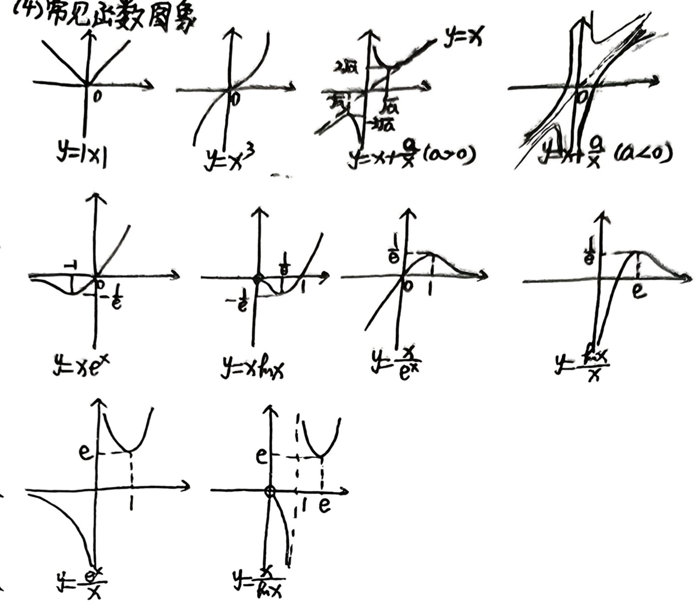
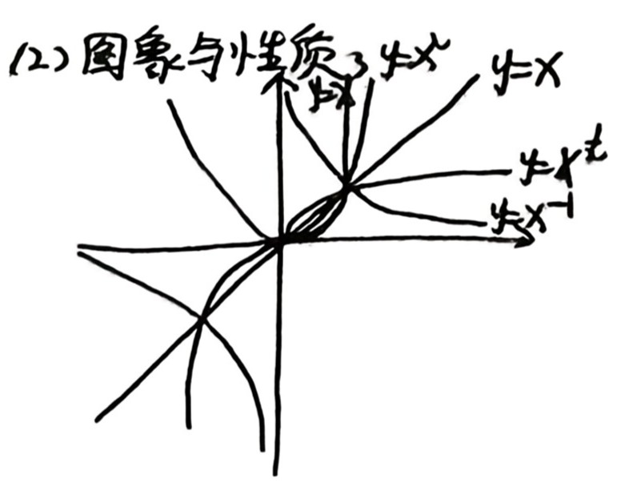
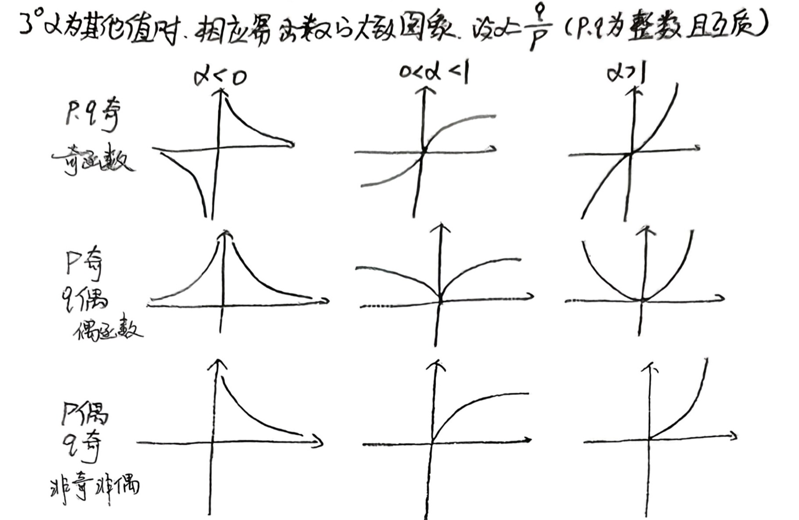
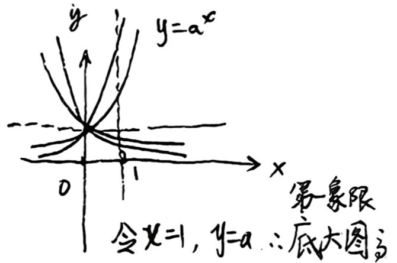
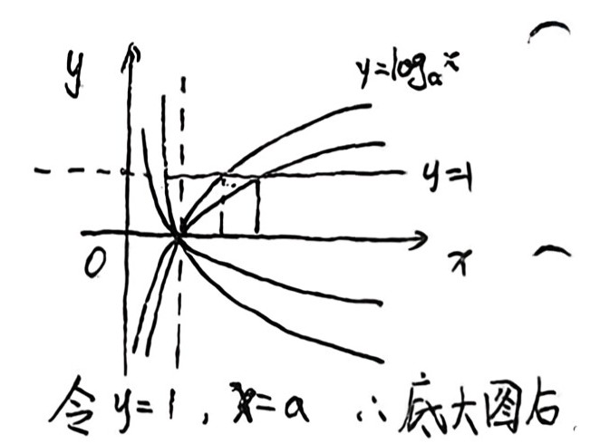

## 高中数学函数知识点留档

首先感谢我的数学老师

### 一、函数的定义

已知$A$、$B$是两个**非空**的实数集，如果对于集合$A$中的任意一个数$x$，按照某种确定的对应关系$f$，在集合$B$中都有唯一确定的数$y$和它对应，那么就称$f:A→B$为从集合$A$到集合$B$的一个函数，记作：$y=f(x),x\in A$。

- $A$中数“任意”取，无剩余；$B$中数可以有剩余。
- $B$中是“唯一”对应，所以对应方式有：一对一、多对一。
- $A=$定义域，$B\supseteq$值域。
- 函数的三要素：定义域、对应关系、值域。

:::note
判断两个函数是否为同一函数，需三要素完全相同。

但因定义域和对应关系确定了值域，所以只要**定义域**和**对应关系**完全相同即为同一函数。

补充：是否为同一函数，与三要素有关，与自变量符号无关。
:::

- $A$、$B$是非空数集，若$card(A)=m$，$card(B)=n$，则$f:A→B$的函数有$n^m$个。
- 映射与函数的关系：函数是特殊的映射。

### 二、定义域（必须写成集合形式）

#### （1）常见类型

- ①分式（分母≠0）；
- ②偶次根式（被开方数≥0）；
- ③$x^0$（$x≠0$）；
- ④$y=log_a x$（$a>0且a≠1$，$x>0$）；
- ⑤$y=a^x$（$a>0且a≠1$，$\in R$）；
- ⑥$y=tanx$（$x≠\frac{\pi}{2}+k\pi,k\in Z$）。

#### （2）实际应用问题

要注意隐含的范围。

#### （3）复合函数

1. 复合函数原理为函数套函数，其自变量为$x$，定义域为$x$的取值范围。
2. 已知$f(x)$的定义域为$I$，求$f(g(x))$的定义域：
    解析：$g(x)\in I$→解出x的范围即为$f(g(x))$的定义域。
    原理：$g(x)$看作整体，是$f(x)$的一个自变量值，地位对等。
3. 已知$f(g(x))$的定义域为$D$，求$f(x)$的定义域：
    解析：$x\in D$→求$g(x)$的范围即为$f(x)$的定义域。
    原理：$f(g(x))$的自变量为$x$，所以定义域是$x$的范围，$g(x)$看作整体是$f(x)$的自变量，地位对等。
4. 已知$f(g(x))$定义域，求$f(h(x))$定义域：先求$f(x)$定义域$D$，再解$h(x)\in D$即可。

#### （4）区间

1. $a<b$（左端点<右端点）；
2. $∞$用开区间；
3. 区间是集合的一种表示形式；
4. 区间是连续的，所以单调区间需用“,”，“和”连接。

### 三、表示法

函数的表示法有：**列表法、图象法、解析式法**。

#### （2）求函数解析式常用方法

1. **拼凑法**：适用于比较简单的、或易于换元的复合函数形式。  
    特点：拼凑成括号里的形式，整体换元，新定义域为括号里的值域。  
    例：$f(x+\frac{1}{x})=x^2+\frac{1}{x^2}$，求$f(x)$。  
    解析：$f(x+\frac{1}{x})=(x+\frac{1}{x})^2-2$，则$f(x)=x^2-2$（$x\geq2$或$x\leq-2$）。  
2. **换元法**：适用于括号里可以解出$x$的复合函数。  
    步骤：设括号里的整体为$t$，反解出$x$关于$t$的函数，代入原式即可，注意新元范围。  
3. **待定系数法**：适用于已知函数类型的情况。  
    - 一次函数：$y=kx+b(k≠0)$；
    - 二次函数：一般式$y=ax^2+bx+c(a≠0)$、两根式$y=a(x-x_1)(x-x_2)(a≠0)$、顶点式$y=a(x-h)^2+k(a≠0)$。
4. **方程组法**：常见于$f(x)$与$f(-x)$、$f(\frac{1}{x})$等形式，用$-x$（或$\frac{1}{x}$）替换原式中的$x$，得到另一个方程，将两方程联立求解$f(x)$。
5. **赋值法**：常用于抽象函数。

### 四、分段函数

1. 分段函数是一个函数，而非多个函数；
2. 分段函数图象分段画，注意端点的虚实；
3. 分段函数的定义域是各段$x$范围的并集，值域是各段值域的并集，最值为整个函数的最值：
4. 分段问题分段处理，分段函数单调性注意分段点处函数值大小

### 五、单调性

#### （1）单调性定义

设函数$f(x)$的定义域为$I$，如果对于$I$内某区间$D$上的**任意**两个自变量$x_1、x_2$，当$x_1<x_2$时，都有$f(x_1)<f(x_2)$（$f(x_1)>f(x_2)$），则称$f(x)$在$D$上是增（减）函数。

:::note

1. 单调区间是定义域的子集，所以研究单调性，先求**定义域**；
2. 增或减是针对区间而言的，所以单调性要说明在某个区间$D$上；
3. $x_1、x_2$是任意的，所以证明单调性时$x_1、x_2$要取任意值；
4. 在不同的区间上有相同增减性，这些单调区间用“,”，“和”连接；
5. 单调性是整体性质，端点的开闭不影响单调性，书写单调区间开区间最安全；
6. 增函数（减函数）必须是在定义域上单调增（减），如$y=tanx$不是增函数，$y=\frac{1}{x}$不是减函数。
7. $$
   \frac{f(x_1)-f(x_2)}{x_1-x_2}>0 \Rightarrow f(x) 增 \\
   [f(x_1)-f(x_2)](x_1-x_2)>0 \Rightarrow f(x) 增 \\
   \frac{f(x_1)-f(x_2)}{x_1-x_2}<0 \Rightarrow f(x) 减 \\
   [f(x_1)-f(x_2)](x_1-x_2)<0 \Rightarrow f(x) 减 \\
   \frac{f(x_1)-f(x_2)}{x_1-x_2}>k \Rightarrow y=f(x)-kx 增
   $$

:::

#### （2）证明单调性

1. **定义法**  
    步骤：假设取值→作差变形→判断符号→下结论。  
    作差的目标：化为几个因式相乘/除的形式、完全平方和的形式，便于定号。  
    变形的方法：二次项式（配方）、多项式（因式分解）、分式（通分）、根式（有理化）。  
2. **导数法**  
    步骤：求导→判断$f'(x)$的符号→下结论。  
    注意：导数与单调性的关系，增函数$f'(x)\geq0$在区间上恒成立，减函数$f'(x)\leq0$在区间上恒成立。

#### （3）判断单调性

1. 定义法；
2. 导数法；求定义域→求导→解不等式→下结论。
3. 图象法；
4. 常用结论：
   $$
   ↑+↑ \Rightarrow ↑ \\
   ↓+↓ \Rightarrow ↓ \\
   ↑-↓ \Rightarrow ↑ \\
   ↓-↑ \Rightarrow ↓ \\
   f(x)↑ \Rightarrow \frac{1}{f(x)}↓ (f(x)恒正/恒负) \\
   f(x)↑ \Rightarrow \sqrt{f(x)}↓ (f(x)\geq0) \\
   f(x)↑ \Rightarrow \begin{cases} a>0,af(x)↑ \\ a<0,af(x)↓ \end{cases} \\
   f(x)↑，g(x)↑，f(x)>0，g(x)>0 \Rightarrow f(x) \cdot g(x)
   $$
5. **复合函数法**：设复合函数$y=f(g(x))$，内函数$u=g(x)$，外函数$y=f(u)$，注意定义域。  
    步骤：求定义域→分解为2个函数→分别判断内外函数的单调性→根据“同增异减”下结论。  
    例：求$y=sin(\omega x+\varphi)(\omega>0)$的单调区间，先求$\omega x+\varphi$的范围，再根据“同增异减”求解。

:::note
结论中单调区间是指$x$的范围。
:::

### 六、二次函数

1. 二次函数的单调性、最值、值域，只需考虑开口方向和对称轴，画简图，结合图象分析。
2. **含参的二次函数在给定区间上求最值**  
    ①若开口向上，求最大值：最大值只会在端点处取得，且谁离对称轴远谁大，所以只需将对称轴和区间中点比较，分两类讨论；  
    ②若开口向上，求最小值：最值可能在端点或顶点处取得，所以将对称轴和区间的位置分三类讨论（对称轴在区间左、内、右）。
3. 二次项系数的绝对值越大，抛物线开口越小。

### 七、值域（必须写成集合形式）

求值域**先求定义域**，常用方法：

1. **观察法**：适用于简单的函数；
2. **配方法**：适用于二次项式、与二次函数复合的$y=af^2(x)+bf(x)+c$型函数；
3. **图象法**：有拐点和渐近线的函数必须画图求值域；
4. **分离常数法**：适用于分式函数，如$y=\frac{cx+d}{ax+b}=\frac{c}{a}+\frac{d-\frac{bc}{a}}{ax+b}$值域为${y|y≠\frac{c}{a}}$；
5. **换元法**：代数换元、三角换元、无理换元，**注意新元范围**，如$y=x+\sqrt{4-x}$、$y=(\sin x+1)(\cos x+1)$；
6. **单调性法**：如$y=1+x-\sqrt{1-2x}$；
7. **反解+有界法**：如$y=\frac{1-\sqrt{x}}{1+\sqrt{x}}$；
8. **导数法**：如$y=2sinx+sin2x$；
9. **数形结合法（几何意义）**：如$y=\frac{1-sinx}{2-3cosx}$、$y=\sqrt{x^2+4}+\sqrt{x^2-2x+10}$；
10. **平方法**：如$y=\sqrt{a-cx}+\sqrt{cx+b}$、$y=|\sin x|+|\cos x|$；
11. **不等式法**：基本不等式、柯西不等式、绝对值三角不等式，如$y=|x+1|+|x-2|$；
12. **判别式法**：如$y=\frac{x^2+3x+5}{x-1}$。

### 八、奇偶性（定义域关于原点对称是前提）

#### （1）奇偶性定义

对于函数$f(x)$，其定义域关于原点对称，若对于定义域内的任意一个$x$，都有$f(-x)=f(x)$（$f(-x)=-f(x)$），则称$f(x)$为偶（奇）函数。

#### （2）判断奇偶性的方法

1. **定义法**  
    步骤：判断定义域是否关于原点对称  
    →求$f(-x)$，判断$f(-x)$与$f(x)$的关系（$f(-x)=\pm f(x)$或$f(-x)\pm f(x)=0$）  
    →下结论（分类：奇函数、偶函数、非奇非偶、既奇又偶）。
2. **图象法**：奇函数图象关于原点对称；偶函数图象关于$y$轴对称。  
    既奇又偶的函数：$f(x)=0$，$x\in D$（D关于原点对称），这样的函数有无穷个。
3. **常见结论**：
   - $f(g(x))$内偶则偶，内奇外偶为偶，内奇外奇为奇（有偶则偶，全奇才奇）；
   - 运算结论：奇±奇=奇，偶±偶=偶，奇×/÷奇=偶，偶×/÷偶=偶，奇×/÷偶=奇；$|奇|=偶$，$|偶|=偶$。

#### （3）常见奇偶函数举例

$y=a^x+a^{-x}$（偶）；$y=a^x-a^{-x}$（奇）；  
$y=\frac{a^x-a^{-x}}{a^x+a^{-x}}=\frac{a^{2x}-1}{a^{2x}+1}=1-\frac{2}{a^{2x}+1}$（奇）；  
$y=\frac{b^x-1}{b^x+1}=1-\frac{2}{b^x+1}$（奇）；  
$y=log_a\frac{1+x}{1-x}$（奇）；  
$y=log_a(\sqrt{bx^2+1}+bx)$（奇）；$y=log_a(a^{mx}+1)-\frac{1}{2}mx$（偶）。

#### （4）性质

1. 若$f(x)$为奇函数且在$x=0$处有定义，则$f(0)=0$；
2. 若$f(x)$为偶函数，则$f(x)=f(-x)=f(|x|)$；
3. 若$f(x)=a_nx^n+a_{n-1}x^{n-1}+\dots+a_1x+a_0$：
    ①$f(x)$为奇函数，则偶次项系数为0（$a_0=a_2=a_4=\dots=0$）；  
    ②$f(x)$为偶函数，则奇次项系数为0（$a_1=a_3=a_5=\dots=0$）；  
    特例：$f(x)=ax^3+bx^2+cx+d$，若为奇函数则$b=d=0$；若为偶函数则$a=c=0$。
4. 若$f(x)=A sin(\omega x+\varphi)$为奇函数，则$\varphi=k\pi$；为偶函数，则$\varphi=\frac{\pi}{2}+k\pi$；
    若$f(x)=A cos(\omega x+\varphi)$为奇函数，则$\varphi=\frac{\pi}{2}+k\pi$；为偶函数，则$\varphi=k\pi$。
5. 对称性与奇偶性推导：
    ①若$f(x+a)$为偶函数，则$f(x+a)=f(-x+a)$，即$f(x)$关于$x=a$对称；  
    ②若$f(x)$为偶函数，则$f(x+a)=f(-x-a)$  
    ③若$f(x+a)$为奇函数，则$f(-x+a)=-f(x+a)$，即$f(x)$关于$(a,0)$对称。  
    思路：$y=f(ax+b)$为偶函数，可令$g(x)=f(ax+b)$，则$g(-x)=g(x)$，即$f(ax+b)=f(-ax+b)$。
6. 单调性：奇函数在关于原点对称的区间内单调性相同；偶函数在关于原点对称的区间内单调性相反。
7. 导数性质：奇函数的导数是偶函数；偶函数的导数是奇函数；导数为奇函数，原函数为偶函数；导数为偶函数，原函数不一定为奇函数（需看常数项）。
8. $f(x)=\frac{f(x)+f(-x)}{2}+\frac{f(x)-f(-x)}{2}$定义在$R$上的任意函数都可以写成一个奇函数和一个偶函数的和。

#### （5）根据奇偶性求参数

1. 定义域对称；
2. 特殊值，如$奇函数f(0)=0$，$f(1)与f(-1)$，需要验证；
3. 定义：$f(x)$与$f(-x)$关系，恒成立。

### 九、周期性

#### （1）周期性定义

若$f(x)$对于定义域中任意$x$，均有$f(x+T)=f(x)$（T为非零常数），则$f(x)$为周期函数，T为周期。

:::note

1. 最小正周期：如果在周期函数的所有周期中存在一个最小正数，则这个正数称为最小正周期；
2. 若无特殊说明，周期一般指最小正周期；
3. 周期函数不一定有最小正周期；
4. 若T为周期，则$kT(k\in Z,k≠0)$也为周期。

:::

#### （2）判断周期的方法

1. **定义法**；
2. **换元法**（常见形式）：  
    ①$f(x)+f(x+a)=k$（常数），则$T=2|a|$；  
    ②$f(x) \cdot f(x+a)=k$（常数且不为0），则$T=2|a|$；  
    ③$f(x+a)=f(x+b)$，则$T=|a-b|$。  
    ④$f(x+a)=\frac{1-f(x)}{1+f(x)},T=2a;f(x+a)=\frac{1+f(x)}{1-f(x)},T=4a$  
    ⑤$f(x+2a)+f(x)=f(x+a),T=6a$。
3. **由对称性推出周期**：  
    ①$f(x)$关于$x=a、x=b$对称，则$T=2|a-b|$；  
    ②$f(x)$关于$(a,0)、(b,0)$对称，则$T=2|a-b|$；  
    ③$f(x)$关于$x=a$和$(b,0)$对称，则$T=4|a-b|$。
4. 补充性质：  
    ①周期为T，关于$x=a$对称，则图象关于$x=a\pm\frac{T}{2}$对称；  
    ②周期为T，关于$(a,0)$对称，则图象关于$(a\pm\frac{T}{2},0)$对称；  
    ③奇函数且周期为T，则$f(\frac{T}{2})=0$。

#### （3）常见函数的周期

1. $y=A sin(\omega x+\varphi)+B$、$y=A cos(\omega x+\varphi)+B$，周期$T=\frac{2\pi}{|\omega|}$；
2. $y=A tan(\omega x+\varphi)+B$，周期$T=\frac{\pi}{|\omega|}$；
3. $y=|A sin(\omega x+\varphi)+B|$，若$B≠0$，则$T=\frac{2\pi}{|\omega|}；若$B=0$，则$T=\frac{\pi}{|\omega|}$；
4. $y=sin|x|$不是周期函数；$y=cos|x|$，$T=2\pi$；
5. $y=C$（C为常数）是周期函数，且周期为任意非零常数。

### 十、对称性

#### （1）两个函数的对称性

1. $y=f(-x)$与$y=f(x)$的图象关于$y$轴对称；
2. $y=-f(x)$与$y=f(x)$的图象关于$x$轴对称；

:::note
关于谁对称谁不变。
:::

3. $y=-f(-x)$与$y=f(x)$的图象关于原点对称；

:::note
关于原点对称都变。
:::

4. $y=f(a+x)$与$y=f(b-x)$的图象关于$x=\frac{b-a}{2}$对称；

:::note
记忆$a+x=b-x$。
:::

5. $y=f(x)$与$y=m-f(n-x)$的图象关于$(\frac{n}{2},\frac{m}{2})$对称。

:::note
记忆$x=n-x$。
:::

#### （2）函数图象自身的对称性

1. 若$y=f(x)$满足$f(a+x)=f(b-x)$，则$f(x)$的图象关于$x=\frac{a+b}{2}$对称；
2. 若$y=f(x)$满足$f(a+x)+f(b-x)=C$，则$f(x)$的图象关于$(\frac{a+b}{2},\frac{C}{2})$对称。

:::note
记忆$\frac{(a+x)+(b-x)}{2}$。
:::

#### （3）平移法求对称性

1. 若$f(x+a)$为偶函数，则$f(x)$关于$x=a$对称；
2. 若$f(x+a)$为奇函数，则$f(x)$关于$(a,0)$对称；

:::note
$y=f(x+a) \xrightarrow{\text{向右平移a个单位长度}} y=f(x)$
:::

1. 若$f(x)$为偶函数，则$f(x)$关于$x=-a$对称；
2. 若$f(x)$为奇函数，则$f(x)$关于$(-a,0)$对称；

:::note
$y=f(x) \xrightarrow{\text{向左平移a个单位长度}} y=f(x+a)$
:::

#### （4）反函数

1. 求反函数的步骤：反解→对调。
2. 反函数的性质：  
    ①原函数与反函数的定义域、值域互换；  
    ②互为反函数的两个函数图象关于$y=x$对称；  
    ③$(a,b)$，$(b,a)$关于$y=x$对称；  
    ④$(a,b)$，$(-b,-a)$关于$y=-x$对称；  
    ⑤$(a,b)$，$(b-m,a+m)$关于$y=x+m$对称；  
    ⑥$(a,b)$，$(m-b,m-a)$关于$y=-x+m$对称；

#### （5）三角函数的对称性

|函数|对称轴|对称中心|
|----|----|----|
|$y=sinx$|$x=\frac{\pi}{2}+k\pi,k\in Z$|$(k\pi,0),k\in Z$|
|$y=cosx$|$x=k\pi,k\in Z$|$(\frac{\pi}{2}+k\pi,0),k\in Z$|
|$y=tanx$|无|$(\frac{k\pi}{2},0),k\in Z$|

:::note
sin,cos:对称轴过图象的最值点；对称中心为图象平衡位置的交点。

tan:对称中心为图象与x轴交点、渐近线与x轴交点。
:::

### 十一、图象（草图草，注重关键特征）

#### （1）图象变换

1. **平移变换**：  
    $y=f(x)→y=f(x+h)$：左加右减，加减只对$x$，有系数要提出去。特别注意“-1”；  
    $y=f(x)→y=f(x)+k$：上加下减，加在函数整体上。
2. **对称变换**：（见第十章两个函数的对称性）
3. **伸缩变换**：  
    $y=f(x)→y=Af(x)$：纵伸纵缩，横坐标不变，纵坐标变为原来的$A(A>0)$倍；  
    $y=f(x)→y=f(\omega x)$：横伸横缩，纵坐标不变，横坐标变为原来的$\frac{1}{\omega}(\omega>0)$倍（$\omega$的变换只对$x$的系数）。
4. **翻折变换**：  
    $y=f(x)→y=|f(x)|$：下翻上，去下；  
    $y=f(x)→y=f(|x|)$：去左，右翻左；  
    $y=f(x)→y=f(-|x|)$：去右，左翻右。

#### （2）画函数图象的方法

描点法、图象变换法。

#### （3）快速画草图的方法

关注10个关键特征：①**特值**；②**定义域**；③**奇偶性**；④**局部正负**；⑤单调性；⑥周期性；⑦**极限思想**；⑧对称性；⑨值域；⑩图象变换。  
**优先考虑**：定义域，奇偶性，特值（包括极限）与符号。

#### （4）画图象的注意点

1. 定义域；
2. 渐近线：指数函数、对数函数、对勾函数、分式函数、反三角函数等需先画渐近线。

#### （5）常见函数图像

### 十二、幂函数

#### （1）幂函数定义

形如$y=x^\alpha$（$\alpha$为常数）的函数叫幂函数。

:::note
①底数为自变量x；  
②指数为常数$\alpha$；  
③系数为1。  
三者缺一不可。
:::

#### （2）图象与性质

1. 所有幂函数都过定点$(1,1)$；
2. $\alpha>0$时，过原点，在$(0,+∞)$上单调递增；$\alpha<0$时，不过原点，在$(0,+∞)$上单调递减；
3. $\alpha>1$时，在$(0,+∞)$上凸；$0<\alpha<1$时，在$(0,+∞)$下凸；
4. 幂函数的图象均不过第四象限；
5. 在直线$x=1$右侧，$\alpha$越大，图象越高；
6. 奇偶性：$\alpha$为奇数则幂函数为奇函数；$\alpha$为偶数则幂函数为偶函数；
7. 特例：①$\alpha=1$，$y=x$（直线）；②$\alpha=0$，$y=x^0=1(x≠0)$**（去掉$(0,1)$的水平直线）**；
8. 一般形式$\alpha=\frac{p}{q}$（$p、q$互质）：
    - 奇函数：$p、q$均为奇数；
    - 偶函数：$p$为偶数、$q$为奇数；
    - 非奇非偶：$p$为奇数、$q$为偶数。

#### （3）求函数过定点的方法

1. 利用与参数有关的式子为定值，如$a^0=1$，$log_a1=0$；
2. 代两组特值，形成方程求解；
3. 若为$m\cdot f(x,y)+n\cdot g(x,y)=0$的形式，则解方程组$\begin{cases}f(x,y)=0\\g(x,y)=0\end{cases}$得定点；
4. 若是直线方程，可将其化为点斜式找定点。

### 十三、指数函数

#### （1）指数及运算

1. 根式：$\sqrt[n]{a}$叫根式，n叫根指数，a叫被开方数；
2. 性质：$(\sqrt[n]{a})^n=a$；$\sqrt[n]{a^n}=\begin{cases}a,n为奇数\\|a|,n为偶数\end{cases}$；$x^0=1(x≠0)$；
3. 根式与指数幂的互化：$\sqrt[n]{a^m}=a^{\frac{m}{n}}$；
4. 负指数幂的变换：$a^{-n}=\frac{1}{a^n}(a≠0)$；
5. 指数的运算公式（$a>0,b>0,m,n\in R$）：
    $a^m\cdot a^n=a^{m+n}$；$(a^m)^n=a^{mn}$；$(ab)^n=a^n\cdot b^n$。

#### （2）指数函数

1. **定义**：形如$y=a^x(a>0且a≠1)$的函数为指数函数。

:::note
①底数为大于0且不等于1的常数；  
②指数为自变量x；  
③系数为1。  
三者缺一不可（与幂函数$y=x^\alpha$区分）。
:::

2. **图象与性质**

|$a$的范围|$0<a<1$|$a>1$|
|----|----|----|
|图象|在R上单调递减的曲线，过$(0,1)$|在R上单调递增的曲线，过$(0,1)$|
|定义域|$R$|$R$|
|值域|$(0,+∞)$|$(0,+∞)$|
|单调性|R上减|R上增|
|定点|$(0,1)$|$(0,1)$|

**结论**：指数函数在第一象限内，底大图高（$x>0$时，$a$越大，函数值越大）。

### 十四、对数函数

#### （1）对数及其运算

1. **定义**：如果$a^b=N(a>0且a≠1)$，则b叫做以a为底N的对数，记作$b=log_aN$。$a$叫底数，$N$叫真数（对数中真数$N>0$）；
2. **和幂的联系**：在$a^b=N$中，$a$叫底数，$N$叫幂，$b$叫指数；
3. **运算性质**（$a>0且a≠1,M>0,N>0,m,n\in R$）：  
    $log_a(MN)=log_aM+log_aN$（真数相乘，对数相加）；  
    $log_a\frac{M}{N}=log_aM-log_aN$（真数相除，对数相减）；  
    $log_aM^n=nlog_aM$；  
    $log_{a^n}b^m=\frac{m}{n}log_ab$；
4. **换底公式**：$log_aN=\frac{log_cN}{log_ca}(c>0且c≠1)$；
    推论：
    - $log_ab\cdot log_ba=1$；
    - $log_{a_1}a_2\cdot log_{a_2}a_3\cdot\dots\cdot log_{a_{n-1}}a_n=log_{a_1}a_n$；
    - $m^{log_an}=m^{log_am}($a>0且a≠1)$（证明：两边对$a$取对）
5. **对数特殊值**：$log_a1=0$；$log_aa=1$；$a^{log_aN}=N$；
6. **常用对数与自然对数**：
    常用对数：$lgN=log_{10}N$；自然对数：$lnN=log_eN$（$e≈2.71828$），且$lne=1$。

#### （2）对数函数

1. **定义**：形如$y=log_a x(a>0且a≠1)$的函数叫对数函数。

:::note
①底数为大于0且不等于1的常数；  
②真数为自变量x；  
③系数为1。  
三者缺一不可。
:::

2. **图象与性质**

|$a$的范围|$0<a<1$|$a>1$|
|----|----|----|
|图象|在$(0,+∞)$上单调递减的曲线，过$(1,0)$|在$(0,+∞)$上单调递增的曲线，过$(1,0)$|
|定义域|$(0,+∞)$|$(0,+∞)$|
|值域|$R$|$R$|
|单调性|$(0,+∞)$上减|$(0,+∞)$上增|
|定点|$(1,0)$|$(1,0)$|

**结论**

1. 对数函数在第一象限内，底大图右（$x>1$时，$a$越大，函数值越小）；
2. 同正异负：底数、真数在同一范围（$(0,1)$或$(1,+∞)$），对数值大于0；否则小于0；
3. 同底的指数函数和对数函数互为反函数。

### 十五、函数与方程

#### （1）函数的零点

函数的零点是函数的图象与x轴交点的横坐标，**零点不是点，是实数根**。

#### （2）零点的判定与求解

1. 直接解方程$f(x)=0$，得零点；
2. 等价转化：函数的零点⇔方程的根⇔两个函数图象交点的横坐标，可根据情况选择分离参数法/半分参/数形结合；
3. **零点存在定理**：若函数$f(x)$在区间$(a,b)$上连续，且$f(a)\cdot f(b)<0$，则$f(x)$在$(a,b)$内存在零点。
    **推论**：若$f(x)$在区间$(a,b)$上连续且单调，且$f(a)\cdot f(b)<0$，则$f(x)$在$(a,b)$内有且仅有一个零点。
4. 特殊函数零点：分段函数零点分段研究，复合函数零点内外层分别研究。

### 十六、二分法

#### （1）二分法定义

对于在$[a,b]$上连续不断且$f(a)\cdot f(b)<0$的函数$y=f(x)$，通过不断地把$f(x)$的零点所在区间一分为二，使区间的两端点逐步逼近零点，进而得到零点近似值的方法叫二分法。

#### （2）步骤

1. 确定区间$[a,b]$，验证$f(a)\cdot f(b)<0$，给定精确度$\varepsilon$；
2. 求区间$(a,b)$的中点$x_1$；
3. 计算$f(x_1)$：  
    ①若$f(x_1)=0$，则$x_1$即为零点；  
    ②若$f(x_1)\cdot f(a)<0$，则零点$\in(a,x_1)$，令$b=x_1$；  
    ③若$f(x_1)\cdot f(b)<0$，则零点$\in(x_1,b)$，令$a=x_1$；
4. 判断是否达到精确度$\varepsilon$：若$|a-b|<\varepsilon$，则得到零点近似值（区间内任一值均可）；否则重复步骤2-4。

### 十七、函数的应用

1. **复利**：把前一期的利息和本金加在一起算作本金，再计算下一期的利息；
2. **平均增长率问题**：如果原来产值/基数为N，平均增长率为p，则经过时间x的总产值$y=N(1+p)^x$；
3. **指数爆炸**：指数函数在底数$a>1$时，函数值增长速度极快，称为指数爆炸增长。
