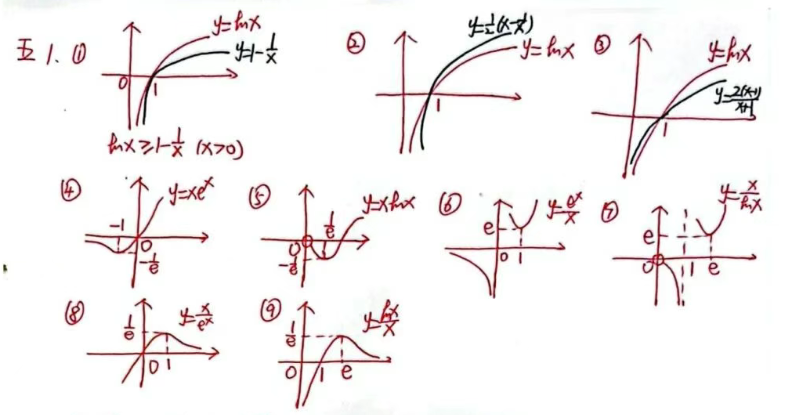
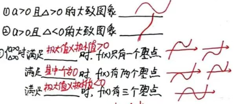
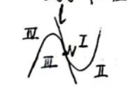

## 高中数学导数知识点留档

首先感谢我的数学老师

### 一、变化率与导数

1. 平均变化率与瞬时变化率的关系：**平均变化率的极限是瞬时变化率**
2. 割线与切线的关系：**割线的极限是切线**
3. “直线与曲线只有一个交点”是“直线是曲线的切线”的：**既不充分也不必要条件**
4. $y=f(x)$ 在 $x=x_0$ 处的导数：
    $$
    f'(x_0)=\lim_{x \to x_0} \frac{f(x)-f(x_0)}{x-x_0} = \lim_{\Delta x \to 0} \frac{f(x_0+\Delta x)-f(x_0)}{\Delta x}
    $$
5. $\Delta x$ 的范围为：$\boldsymbol{\Delta x \neq 0}$
6. 导数的几何意义：这一点的导数值是这点**切线的斜率**
7. $y=|x|$ 在 $x=0$ 处的导数：**不存在**
    $$
    \lim_{x \to 0^+} \frac{f(x)-f(0)}{x} = \lim_{x \to 0^+} \frac{x-0}{x}=1; \quad \lim_{x \to 0^-} \frac{f(x)-f(0)}{x} = \lim_{x \to 0^-} \frac{-x}{x}=-1
    $$
8. 某点有导数必有切线，有切线未必有导数（$\boldsymbol{\checkmark}$）
9. $f'(x_1)>f'(x_2)$ 反映曲线在 $x=x_1$ 处比 $x=x_2$ 处的瞬时变化快（$\boldsymbol{\times}$）（需要同号才能比，变化速率看绝对值）
10. $f(x)=x^3$ 在原点处的切线方程为：$\boldsymbol{y=0}$
11. “在”与“过”求切线方程的步骤：
    1. 分清“在”与“过”：“在”处是切点，“过”时没切点
    2. 假设切点，列切线方程，验证（切点在曲线、过点在切线上）

---

### 二、导数的运算

#### 1. 基本求导公式

$$
(c)'={0}\quad
(x^\alpha)'={\alpha x^{\alpha-1}}\quad
(\sin x)'={\cos x}\quad
(\cos x)'={-\sin x} \\
(a^x)'={a^x \ln a}\quad
(e^x)'={e^x}\quad
(\log_a x)'={\frac{1}{x \ln a}}\quad
(\ln x)'={\frac{1}{x}} \\
(x \ln x)'={\ln x + 1}\quad
(\frac{1}{x})'={-\frac{1}{x^2}}\quad
(\sqrt{x})'={\frac{1}{2\sqrt{x}}} \\
(e^x f(x))'={e^x(f(x)+f'(x))} \quad
\left[\frac{f(x)}{e^x}\right]'={\frac{f'(x)-f(x)}{e^x}}
$$

#### 2. 四则运算法则

$$
(f \pm g)' = {f' \pm g'}\quad
(f \cdot g)' = {f'g + fg'} \\
\left(\frac{f}{g}\right)' = {\frac{f'g - fg'}{g^2}} \\
[f(g(x))]' = {f'(g(x)) \cdot g'(x)}\quad
(f \cdot g \cdot h)' = {f'gh + fg'h + fgh'}
$$

#### 3. 推导函数的导数

① $f(x)=x^3$  ② $f(x)=\sqrt{x}$  ③ $f \cdot g$（见下面推导）

① $\lim_{\Delta x \to 0} \frac{(x+\Delta x)^3 - x^3}{\Delta x} = \lim_{\Delta x \to 0} \frac{\Delta x[(x+\Delta x)^2+(x+\Delta x)x+x^2]}{\Delta x} = \lim_{\Delta x \to 0} (3x^2+3x\Delta x+\Delta x^2) = 3x^2$  
② $\lim_{\Delta x \to 0} \frac{\sqrt{x+\Delta x}-\sqrt{x}}{\Delta x} = \lim_{\Delta x \to 0} \frac{\Delta x}{\Delta x(\sqrt{x+\Delta x}+\sqrt{x})} = \lim_{\Delta x \to 0} \frac{1}{\sqrt{x+\Delta x}+\sqrt{x}} = \frac{1}{2\sqrt{x}}$  
③ 乘积求导法则推导：

$$
\begin{align*}
\lim_{\Delta x \to 0} \frac{f(x+\Delta x)g(x+\Delta x)-f(x)g(x)}{\Delta x} &= \lim_{\Delta x \to 0} \frac{f(x+\Delta x)g(x+\Delta x)-f(x)g(x+\Delta x)+f(x)g(x+\Delta x)-f(x)g(x)}{\Delta x} \\
&= \lim_{\Delta x \to 0} \frac{f(x+\Delta x)[g(x+\Delta x)-g(x)]+g(x)[f(x+\Delta x)-f(x)]}{\Delta x} \\
&= \lim_{\Delta x \to 0} \left[f(x+\Delta x) \cdot \frac{g(x+\Delta x)-g(x)}{\Delta x}\right] + \lim_{\Delta x \to 0} \left[g(x) \cdot \frac{f(x+\Delta x)-f(x)}{\Delta x}\right] \\
&= \lim_{\Delta x \to 0} f(x+\Delta x) \cdot \lim_{\Delta x \to 0} \frac{g(x+\Delta x)-g(x)}{\Delta x} + g(x) \lim_{\Delta x \to 0} \frac{f(x+\Delta x)-f(x)}{\Delta x} \\
&= f(x) \cdot g'(x) + g(x) \cdot f'(x)
\end{align*}
$$

#### 4. 隐函数求导

例：$x^2+4y^2-4=0$，求导：
$$
2x + 8y \cdot y' = 0 \implies x + 4y \cdot y' = 0
$$
（高中阶段把$y$当作$y(x)$处理，然后对$x$求导即可）

---

### 三、应用

1. **求单调性的步骤**：①求定义域 ②求导 ③判断 $f'(x)>0,f'(x)<0$ ④下结论
2. $f'(x)=0$ 在某区间上恒成立，则 $f(x)$ 在此区间上为常函数
3. 单调性与导数的转化：
    - 已知 $f(x)$ 在区间 $D$ 上单增，可转化为 $\boldsymbol{f'(x) \geq 0}$ 在 $D$ 上恒成立且 $f'(x)$ 不恒为0
    - 已知 $f(x)$ 的增区间为 $D$，可转化为 $\boldsymbol{f'(x)>0}$ 的解集为 $D$
    - 已知 $f(x)$ 在区间 $D$ 上存在增区间，可转化为 $\boldsymbol{f'(x)>0}$ 在此区间上有解
4. 导数 $f'(x)$ 的图象反映 $f(x)$ 的性质：导函数**正负**反映原函数**增减**，导函数**增减**反映原函数**凹凸**（$f''(x) \geq 0$ 下凸，$f''(x) \leq 0$ 上凸）
5. $f(x)$ 在区间 $D$ 上是凸函数 $\iff f''(x) \leq 0 \iff f\left(\frac{x_1+x_2}{2}\right) \geq \frac{f(x_1)+f(x_2)}{2}$
6. **极值与最值的区别**：极值是**局部**概念，最值是**整体**概念；最值来自于**极值或端点**
7. **说“点”不是“点”**：极值点、零点（指函数性质，非几何点）
8. **极小值点的定义**：
    ① $f(x)$ 在 $x=a$ 的函数值 $f(a)$ 比 $a$ 附近的函数值都小；
    ② $f'(a)=0$，且在 $x=a$ 的左侧 $f'(x)<0$，右侧 $f'(x)>0$，则 $a$ 叫极小值点
9. **求极值的步骤**：①求定义域 ②求导 ③求单调性 ④求极值
10. **最大值的定义**：① $\forall x \in$ 定义域 $I$，都有 $f(x) \leq M$；② $\exists x_0 \in I$，使得 $f(x_0)=M$
11. **求最值的步骤**：①求极值 ②求端点函数值 ③比较下结论
12. $f(x)$ 奇偶性与 $f'(x)$ 奇偶性的关系：
    1. 奇函数的导数是偶函数，反之不一定（有常数项）
    2. 偶函数的导数是奇函数，反之也成立
13. $f(x)$ 周期与 $f'(x)$ 周期的关系：$f(x)$ 周期与 $f'(x)$ 周期相同
14. 已知 $x_0$ 是 $f(x)$ 的极值点，求参数的方法：① $f'(x_0)=0$ ②验证

---

### 四、恒成立与能成立

#### 1. 基础结论

1. $f(x)>a$ 恒成立 $\iff {a < f(x)_{\min}}$
2. $a < f(x)$ 能成立 $\iff {a < f(x)_{\max}}$

:::note
从参数开始读  
恒成立：大大小小  
能成立：大小小大
:::

3. $f(x)>g(x)$ 恒成立 $\iff {[f(x)-g(x)]_{\min} > 0}$
4. $\forall x_1,x_2$，有 $f(x_1)>g(x_2) \iff {f(x)_{\min} > g(x)_{\max}}$
5. $\exists x_1,x_2$，有 $f(x_1)>g(x_2) \iff {f(x)_{\max} > g(x)_{\min}}$
6. $\forall x_1, \exists x_2$，有 $f(x_1)>g(x_2) \iff {f(x)_{\min} > g(x)_{\min}}$

:::note
双变量不等式  
一动一静  
各个击破  
找最值关系
:::

7. $a=f(x)$ 成立 $\iff {a \in f(x) 的值域}$
8. $\forall x_1, \exists x_2$，有 $f(x_1)=g(x_2) \iff {f(x) 值域 \subseteq g(x) 值域}$
9. $\forall x_1,x_2$，有 $|f(x_1)-f(x_2)|<C$ 成立 $\iff {f(x)_{\max}-f(x)_{\min} < C}$

#### 2. 对称性与恒成立

- $f(x)$ 的图象关于 $x=a$ 对称 $\iff f(x)$ 的图象关于 $(a,0)$ 对称
- $f(x)$ 的图象关于 $(a,b)$ 对称 $\iff f(x)$ 的图象关于 $x=a$ 对称
- $f(x)$ 的图象关于 $x=a$ 对称 $\iff f(x)$ 的图象关于 $(a,t)$ 对称

---

### 五、图象

#### 1. 常见函数的图象



#### 2. 求极值点（第7页补充）

① $y=(x-1)e^x = \frac{(x-1)e^{x-1}}{e}$，极小值为 $0$（$y=x e^x$ 变型）  
② $y=x e^{x+1} = x e^x \cdot e$，极小值为 $-1$（$y=x e^x$ 变型）  
③ $y=\frac{e^x}{x-1} = \frac{e^{x-1}}{x-1} \cdot e$，极小值为 $2$（$y=\frac{e^x}{x}$ 变型）  
④ $y=\frac{e^{x+1}}{x} = \frac{e^x}{x} \cdot e$，极小值为 $1$（$y=\frac{e^x}{x}$ 变型）  
⑤ $y=x^2 \ln x = \frac{x^2 \ln x^2}{2}$，极小值为 $\frac{1}{\sqrt{e}}$（$y=x \ln x$ 变型）  
⑥ $y=\frac{\ln x}{x^2} = \frac{\ln x^2}{2x^2}$，极大值为 $\sqrt{e}$（$y=\frac{\ln x}{x}$ 变型）  
⑦ $y=\frac{\ln x + 1}{x} = \frac{\ln (e x)}{e x} \cdot e$，极大值为 $1$（$y=\frac{\ln x}{x}$ 变型）  
⑧ $y=\frac{\ln x - 1}{x} = \frac{\ln \frac{x}{e}}{\frac{x}{e}} \cdot \frac{1}{e}$，极大值为 $e^{2}$（$y=\frac{\ln x}{x}$ 变型）

#### 3. 画函数大致图象的步骤

奇偶性 $\to$ 单调性 $\to$ 特殊点 $\to$ 极值点等

---

### 六、三次函数 $f(x)=ax^3+bx^2+cx+d\ (a \neq 0)$

$$
f'(x)=3ax^2+2bx+c, \quad \Delta=4b^2-12ac
$$



1. $a>0$ 且 $\Delta>0$ 的大致图象
2. $a>0$ 且 $\Delta<0$ 的大致图象
3. 零点个数判定（$a>0$ 且 $\Delta>0$）：
    - 满足**极大值×极小值>0**时，$f(x)$ 只有一个零点
    - 满足**其中一个为0**时，$f(x)$ 有两个零点
    - 满足**极大值×极小值<0**时，$f(x)$ 有三个零点
4. 函数的对称中心为 $\left(-\frac{b}{3a}, f\left(-\frac{b}{3a}\right)\right)$，对称轴 $x=-\frac{b}{3a}$
5. 根与系数的关系（韦达定理）：
    $$
    x_1+x_2+x_3 = -\frac{b}{a}, \quad x_1x_2+x_1x_3+x_2x_3 = \frac{c}{a}, \quad x_1x_2x_3 = -\frac{d}{a}
    $$
6. 过点 $P$ 作三次函数 $f(x)=ax^3+bx^2+cx+d\ (a>0)$ 图象的切线条数：
    $l$ 为 $y=f(x)$ 在其对称中心 $N$ 处的切线，曲线与切线将平面分成Ⅰ、Ⅱ、Ⅲ、Ⅳ四部分：
    - 当 $P$ 在 $N$ 或Ⅰ、Ⅲ区时，切线有 $\boldsymbol{1}$ 条
    - 当 $P$ 在Ⅱ、Ⅳ区时，切线有 $\boldsymbol{3}$ 条
    - 当 $P$ 在曲线或 $l$ 上（不含 $N$）时，切线有 $\boldsymbol{2}$ 条


---

### 七、构造函数常用技巧

$$
\begin{align*}
&①\ f'(x)g(x)+f(x)g'(x) \quad \Leftrightarrow \quad [f(x)g(x)]' \\
&②\ f'(x)g(x)-f(x)g'(x) \quad \Leftrightarrow \quad \left[\frac{f(x)}{g(x)}\right]' \\
&③\ nf(x)+xf'(x) \quad \Leftrightarrow \quad [x^n f(x)]' \\
&④\ xf'(x)-nf(x) \quad \Leftrightarrow \quad \left[\frac{f(x)}{x^n}\right]' \\
&⑤\ \tan x \cdot f'(x)+f(x) = \frac{[\sin x \cdot f(x)]'}{\cos x} \\
&⑥\ \tan x \cdot f'(x)-f(x) = \frac{[\sin x \cdot f'(x)-\cos x \cdot f(x)]}{\cos x} = \left[\frac{f(x)}{\sin x}\right]' \frac{1}{\cos x} \\
&⑦\ f'(x)-\tan x \cdot f(x) = \left[\frac{f(x)}{\sin x}\right]' \sin x = \frac{[\cos x \cdot f'(x)-\sin x \cdot f(x)]}{\cos x} = \left[f(x)\cos x\right]' \frac{1}{\cos x} \\
&⑧\ f'(x)+\tan x \cdot f(x) = \frac{[\cos x \cdot f'(x)+\sin x \cdot f(x)]}{\cos x} = \left[\frac{f(x)}{\cos x}\right]' \frac{1}{\cos x}
\end{align*}
$$

---

### 八、指对同构

#### 1. 基础同构式

$$
\begin{align*}
&①\ x e^x = e^{x+\ln x} \\
&②\ \frac{e^x}{x} = e^{x-\ln x} \\
&③\ x+\ln x = \ln(x e^x) \\
&④\ x-\ln x = \ln\frac{e^x}{x}
\end{align*}
$$

#### 2. 常见同构变形

① $a e^a \leq b \ln b$：令 $f(x)=x e^x$ 或 $x \ln x$ 或 $\ln x + x$  
② $\frac{e^a}{a} < \frac{b}{\ln b}$：令 $f(x)=\frac{e^x}{x}$ 或 $\frac{x}{\ln x}$ 或 $x-\ln x$  
③ $e^a - a \geq b - \ln b$：令 $f(x)=e^x - x$ 或 $x - \ln x$  
④ $a e^{ax} > \ln x$：令 $f(x)=x e^x$，$ax \cdot e^{ax} > x \ln x$  
⑤ $e^x > a \ln(ax-a)-a$：令 $f(x)=e^x+x$，$\frac{e^x}{a} > \ln a + \ln(x-1)-1 \implies e^{x-\ln a} + x - \ln a > \ln(x-1)+x+1$

---

### 九、常用不等式

#### 1. 基础不等式

① $e^x \geq x+1 > x > x-1 \geq \ln x$  
② $x \in (0,\frac{\pi}{2})$：$\sin x < x < \tan x$  
③ $\sqrt{\frac{a^2+b^2}{2}} > \frac{a+b}{2} > \frac{b-a}{\ln b - \ln a} (\text{对数均值不等式}) > \sqrt{ab} > \frac{2}{\frac{1}{a}+\frac{1}{b}}\ (b>a>0)$  
    证明：令$\frac{b}{a}=x$，然后构造即可  
④ $e^x \geq e x$，$\ln x \leq \frac{1}{e}x$  

#### 2. 泰勒展开式

$$
f(x)=f(x_0)+\frac{f'(x_0)}{1!}(x-x_0)+\frac{f''(x_0)}{2!}(x-x_0)^2+\dots+\frac{f^{(n)}(x_0)}{n!}(x-x_0)^n+R_n(x) \quad (\text{余项})
$$

$x_0=0$ 时，麦克劳林展开式：

$$
\begin{align*}
e^x &= 1+x+\frac{x^2}{2!}+\frac{x^3}{3!}+\dots+\frac{x^n}{n!}+o(x^n) \\
\ln(1+x) &= x-\frac{x^2}{2}+\frac{x^3}{3}-\frac{x^4}{4}+\dots+(-1)^{n-1}\frac{x^n}{n}+o(x^n) \\
\sin x &= x-\frac{x^3}{3!}+\frac{x^5}{5!}-\dots+(-1)^{k-1}\frac{x^{2k-1}}{(2k-1)!}+o(x^{2k}) \\
\cos x &= 1-\frac{x^2}{2!}+\frac{x^4}{4!}-\dots+(-1)^k\frac{x^{2k}}{(2k)!}+o(x^{2k}) \\
\frac{1}{1+x} &= 1-x+x^2-\dots+(-1)^{n-1}x^n
\end{align*}
$$

#### 3. 切线放缩

以核心不等式 $\boldsymbol{e^x \geq 1+x}$ 为根，完整推导链如下：

---

##### 一、核心母不等式

$$
\boldsymbol{e^x \geq 1+x} \quad (\text{等号当且仅当 } x=0 \text{ 时成立})
$$

---

##### 二、第一分支：$e^x$ 衍生不等式

1.  对母式做**变量替换 $x \to x-1$**：
    $$
    e^{x-1} \geq x \implies \boldsymbol{e^x \geq ex} \quad (\text{等号当且仅当 } x=1 \text{ 时成立})
    $$
2.  对 $e^x \geq ex$ 做**变量替换 $x \to \ln x$**（$x>0$）：
    $$
    x \geq e\ln x \implies \boldsymbol{\ln x \leq \frac{1}{e}x} \quad (\text{等号当且仅当 } x=e \text{ 时成立})
    $$
3.  对 $\ln x \leq \frac{1}{e}x$ 做**变量替换 $x \to \frac{1}{x}$**（$x>0$）：
    $$
    -\ln x \leq \frac{1}{ex} \implies \boldsymbol{-\frac{1}{e}x \leq \ln x} \quad (\text{等号当且仅当 } x=\frac{1}{e} \text{ 时成立})
    $$
4.  对母式做**变量替换 $x \to -x$**（$x>1$）：
    $$
    e^{-x} \geq 1-x \implies \boldsymbol{e^x \geq \frac{1}{1-x} \ (x>1)}
    $$

---

##### 三、第二分支：$\ln x$ 衍生不等式

1.  对母式做**变量替换 $x \to \ln x$**（$x>0$）：
    $$
    x \geq 1+\ln x \implies \boldsymbol{\ln x \leq x-1} \quad (\text{等号当且仅当 } x=1 \text{ 时成立})
    $$
2.  对母式做**变量替换 $x \to \ln(1+x)$**（$x>-1$）：
    $$
    1+x \geq 1+\ln(1+x) \implies \boldsymbol{\ln(1+x) \leq x} \quad (\text{等号当且仅当 } x=0 \text{ 时成立})
    $$
3.  对 $\ln x \leq x-1$ 做**变量替换 $x \to \frac{1}{x}$**（$x>0$）：
    $$
    -\ln x \leq \frac{1}{x}-1 \implies \boldsymbol{\ln x \geq 1-\frac{1}{x}} \quad (\text{等号当且仅当 } x=1 \text{ 时成立})
    $$
4.  联立 $\ln x \leq x-1$ 与 $\ln x \geq 1-\frac{1}{x}$，得到核心双向不等式：
    $$
    \boldsymbol{1-\frac{1}{x} \leq \ln x \leq x-1} \quad (x>0, \text{等号当且仅当 } x=1 \text{ 时成立})
    $$
5.  对 $1-\frac{1}{x} \leq \ln x \leq x-1$ 做**变量替换 $x \to x+1$**（$x>-1$）：
    $$
    \boldsymbol{\frac{x}{x+1} \leq \ln(1+x) \leq x} \quad (\text{等号当且仅当 } x=0 \text{ 时成立})
    $$

---

```
                e^x ≥ 1+x (核心)
                /       |       \
               /        |        \
e^x ≥ 1/(1-x)(x>1)  ln(1+x)≤x  ln x ≤ x-1
      |              |              |
      |              ↓x+1→x         ↓1/x→x
      |            ln x ≤ x-1  ln x ≥ 1-1/x
      |              |              |
      ↓x-1→x         └──────────────┘
    e^x ≥ ex                     1-1/x ≤ ln x ≤ x-1
      |                                  |
      ↓ln x→x                            ↓x+1→x
   ln x ≤ (1/e)x                   x/(x+1) ≤ ln(1+x) ≤ x
      |
      ↓1/x→x
  - (1/e)x ≤ ln x
```

---

### 十、隐零点

超越方程的两种处理方式：

1. 观察出根，搭配单调性定解
2. 用零点存在定理确定根的存在，但无法显性表达，采用**设而不求**的策略

#### 步骤

1° 利用零点存在定理判定其零点的存在性，并结合函数的单调性确定零点的范围  
2° 以零点为分界，说明 $f'(x)$ 的正负，判断 $f(x)$ 的单调性  
3° 将零点方程适当变形，代入需要式子化简求解

---

### 十一、极值点偏移

#### 方法

- 移项（两极值点之积、之和相关的不等式问题，从结论出发，反向分析）
- 换元（常用比值、差值换元）
- $\rightarrow$ 构造函数

---

### 十二、恒成立与能成立（补充）

1. 结论

① 二次函数 $f(x)=ax^2+bx+c<0\ (a>0)$ 在 $[m,n]$ 上恒成立，则 $\begin{cases} f(m)<0 \\ f(n)<0 \end{cases}$  
② 一次函数 $f(x)=kx+b>0$ 在 $[m,n]$ 上恒成立，则 $\begin{cases} f(m)>0 \\ f(n)>0 \end{cases}$；  
在 $[m,+\infty)$ 上恒成立，则 $\begin{cases} k>0 \\ f(m)>0 \end{cases}$

2. 优先考虑**参变分离**
3. 直接法

---

### 十三、不等式证明

1. 作差构造法
2. 双函数构造法（直接比较复杂或无从下手时用，本质是中间变量法，慎用！）
3. 放缩法

---

### 十四、求单调性

1. 求定义域
2. 求导化简（常见通分、分解因式）
3. 含参时，从“恒正恒负”入手分类讨论
