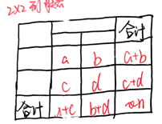
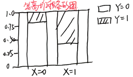

## 高中数学成对数据统计分析知识点留档

首先感谢我的数学老师

### 一、两个变量的相关关系

#### 1. 变量关系分类

根据两个变量之间的关系，可分为：

- 函数关系
- 相关关系
- 不相关

根据两个变量的变化趋势，可分为：

- 正相关
- 负相关

#### 2. 核心概念

- **相关关系**：两个变量有关系，但没有确切到可由其中一个精确地决定另一个的程度。
- **线性相关**：两个变量的取值呈正相关或负相关，且散点落在一条直线附近。
- **非线性相关（曲线相关）**：两个变量具有相关性，但不是线性相关。

#### 3. 线性相关判断方法

- 散点图
- 样本相关系数 $r$

#### 4. 协方差公式

$$
L_{xy} = \frac{1}{n}\sum_{i=1}^{n}(x_i-\bar{x})(y_i-\bar{y})
$$

- 作用：对“中心化”的数据取平均值
- 符号意义：$L_{xy}>0$ 正相关；$L_{xy}<0$ 负相关

#### 5. 样本相关系数

通过对样本数据的中心化、标准化，得到样本相关系数 $r$：
$$
r = \frac{\sum_{i=1}^{n}(x_i-\bar{x})(y_i-\bar{y})}{\sqrt{\sum_{i=1}^{n}(x_i-\bar{x})^2}\sqrt{\sum_{i=1}^{n}(y_i-\bar{y})^2}} = \frac{\sum_{i=1}^{n}x_iy_i - n\bar{x}\bar{y}}{\sqrt{\sum_{i=1}^{n}x_i^2 - n\bar{x}^2}\sqrt{\sum_{i=1}^{n}y_i^2 - n\bar{y}^2}}
$$
（会推导公式的变形）

- **取值范围**：$[-1,1]$
- $r=0$：成对样本数据间没有线性相关关系，但不排除它们之间有其他相关关系
- $|r|$ 越接近 $1$：样本数据的线性相关程度越强
- $r>0$：成对样本数据正相关
- $|r|>0.75$时可认为相关程度强

#### 6.样本相关系数 $r$ 推导

1. 标准化变换

对数据进行中心化、标准化处理：
$$
x_i' = \frac{x_i - \bar{x}}{s_x}, \quad y_i' = \frac{y_i - \bar{y}}{s_y}
$$
其中样本标准差：
$$
s_x = \sqrt{\frac{1}{n}\sum_{i=1}^n (x_i-\bar{x})^2}, \quad s_y = \sqrt{\frac{1}{n}\sum_{i=1}^n (y_i-\bar{y})^2}
$$
构造向量：
$$
\vec{\alpha} = (x_1', x_2', \dots, x_n'), \quad \vec{\beta} = (y_1', y_2', \dots, y_n')
$$

2. 向量内积与夹角

向量内积公式：
$$
\vec{\alpha} \cdot \vec{\beta} = |\vec{\alpha}| |\vec{\beta}| \cos\theta
$$

- 计算向量模长：
$$
|\vec{\alpha}|^2 = \sum_{i=1}^n x_i'^2 = \sum_{i=1}^n \frac{(x_i-\bar{x})^2}{s_x^2} = \frac{n s_x^2}{s_x^2} = n \implies |\vec{\alpha}| = \sqrt{n}
$$
同理 $ |\vec{\beta}| = \sqrt{n} $。

- 计算内积：
$$
\vec{\alpha} \cdot \vec{\beta} = \sum_{i=1}^n x_i' y_i' = \sum_{i=1}^n \frac{(x_i-\bar{x})(y_i-\bar{y})}{s_x s_y}
$$

3. 相关系数的几何意义

样本相关系数定义：
$$
r = \frac{\sum_{i=1}^n (x_i-\bar{x})(y_i-\bar{y})}{\sqrt{\sum_{i=1}^n (x_i-\bar{x})^2} \sqrt{\sum_{i=1}^n (y_i-\bar{y})^2}} = \frac{\frac{1}{n}\sum_{i=1}^n (x_i-\bar{x})(y_i-\bar{y})}{s_x s_y}
$$
代入内积公式：
$$
r = \frac{1}{n} \vec{\alpha} \cdot \vec{\beta} = \frac{1}{n} |\vec{\alpha}| |\vec{\beta}| \cos\theta = \cos\theta
$$
因此 $ r = \cos\theta \in [-1,1] $。

---

### 二、经验回归方程

#### 1. 最小二乘法思想

从整体上看，各点与直线的距离最小，该方法叫**最小二乘法**。

#### 2. 经验回归直线方程

经验回归直线方程 $\hat{y} = \hat{b}x + \hat{a}$ 中：
$$
\hat{b} = \frac{\sum_{i=1}^{n}(x_i-\bar{x})(y_i-\bar{y})}{\sum_{i=1}^{n}(x_i-\bar{x})^2} = \frac{\sum_{i=1}^{n}x_iy_i - n\bar{x}\bar{y}}{\sum_{i=1}^{n}x_i^2 - n\bar{x}^2}
$$
$$
\hat{a} = \bar{y} - \hat{b}\bar{x}
$$

#### 3. 核心性质

- 经验回归直线方程一定过点 **样本中心 $(\bar{x},\bar{y})$**
- $\hat{b}$ 与 $r$ 的正负相关性：$\hat{b}>0, r>0$ 正相关；$\hat{b}<0, r<0$ 负相关
- 当 $x$ 增大一个单位时，$\hat{y}$ **平均**增大 $\hat{b}$ 个单位

#### 4. 观测值与预测值

- 观测值：通过观测得到的数据 $y_i$
- 预测值：通过经验回归方程得到的 $\hat{y}_i$
- 残差：$e_i = y_i - \hat{y}_i$

:::note
记忆法：关羽（观预）
:::

#### 5. 残差图

- 绘制方法：横坐标为数据，纵坐标为残差
- 拟合效果好的特征：残差**均匀地分布**在以取值为0的**横轴为对称轴**的**水平带状区域**内

#### 6. 非线性回归方程

以 $y = ce^{gx}$ 为例，通过换元将其转化为线性回归：
$$
\ln y = \ln c + gx
$$

#### 7. 决定系数

$$
R^2 = 1 - \frac{\sum_{i=1}^{n}(y_i-\hat{y}_i)^2}{\sum_{i=1}^{n}(y_i-\bar{y})^2}
$$

- $R^2$ **越大**，表示残差平方和**越小**，模型的拟合效果**越好**

#### 8. 拟合效果判断方法

- 一元线性回归模型：相关系数 $r$、决定系数 $R^2$、残差图
- 非线性回归模型：决定系数 $R^2$、残差图

#### 9.回归系数 $ \hat{b}, \hat{a} $ 的推导

1. 残差平方和定义

设经验回归方程为 $ \hat{y} = bx + a $，残差平方和：
$$
Q(a,b) = \sum_{i=1}^n (y_i - bx_i - a)^2
$$

2. 配方变形

利用 $ \bar{y} = b\bar{x} + a $，对 $ y_i - bx_i - a $ 拆分：
$$
\begin{align*}
y_i - bx_i - a &= (y_i - \bar{y}) - b(x_i - \bar{x}) + (\bar{y} - b\bar{x}) - a \\
&= \left[(y_i - \bar{y}) - b(x_i - \bar{x})\right] + \left[(\bar{y} - b\bar{x}) - a\right]
\end{align*}
$$
代入 $ Q(a,b) $ 展开：
$$
\begin{align*}
Q(a,b) &= \sum_{i=1}^n \left\{ \left[(y_i - \bar{y}) - b(x_i - \bar{x})\right] + \left[(\bar{y} - b\bar{x}) - a\right] \right\}^2 \\
&= \sum_{i=1}^n \left[(y_i - \bar{y}) - b(x_i - \bar{x})\right]^2 + 2\left[(\bar{y} - b\bar{x}) - a\right] \sum_{i=1}^n \left[(y_i - \bar{y}) - b(x_i - \bar{x})\right] \\
&\quad + n \left[(\bar{y} - b\bar{x}) - a\right]^2
\end{align*}
$$

3. 交叉项化简

由 $ \sum_{i=1}^n (x_i - \bar{x}) = 0 $，$ \sum_{i=1}^n (y_i - \bar{y}) = 0 $，得：
$$
\sum_{i=1}^n \left[(y_i - \bar{y}) - b(x_i - \bar{x})\right] = \sum_{i=1}^n (y_i - \bar{y}) - b\sum_{i=1}^n (x_i - \bar{x}) = 0
$$
因此交叉项为0，残差平方和简化为：
$$
Q(a,b) = \sum_{i=1}^n \left[(y_i - \bar{y}) - b(x_i - \bar{x})\right]^2 + n \left[(\bar{y} - b\bar{x}) - a\right]^2
$$

4. 求最小值

- 第二项 $ n \left[(\bar{y} - b\bar{x}) - a\right]^2 \geq 0 $，当且仅当 $ a = \bar{y} - b\bar{x} $ 时取最小值0，因此截距：

$$
\hat{a} = \bar{y} - \hat{b}\bar{x}
$$

- 此时 $ Q(a,b) $ 仅与 $ b $ 有关，展开第一项：

$$
\begin{align*}
Q(b) &= \sum_{i=1}^n \left[(y_i - \bar{y}) - b(x_i - \bar{x})\right]^2 \\
&= b^2 \sum_{i=1}^n (x_i - \bar{x})^2 - 2b \sum_{i=1}^n (x_i - \bar{x})(y_i - \bar{y}) + \sum_{i=1}^n (y_i - \bar{y})^2
\end{align*}
$$
这是关于 $ b $ 的二次函数，开口向上，最小值在顶点处取得：
$$
\hat{b} = \frac{\sum_{i=1}^n (x_i - \bar{x})(y_i - \bar{y})}{\sum_{i=1}^n (x_i - \bar{x})^2}
$$

5. 公式变形（展开验证）

展开分子 $ \sum_{i=1}^n (x_i - \bar{x})(y_i - \bar{y}) $：
$$
\begin{align*}
\sum_{i=1}^n (x_i - \bar{x})(y_i - \bar{y}) &= \sum_{i=1}^n x_i y_i - \bar{x}\sum_{i=1}^n y_i - \bar{y}\sum_{i=1}^n x_i + n\bar{x}\bar{y} \\
&= \sum_{i=1}^n x_i y_i - n\bar{x}\bar{y}
\end{align*}
$$
同理分母 $ \sum_{i=1}^n (x_i - \bar{x})^2 = \sum_{i=1}^n x_i^2 - n\bar{x}^2 $，因此：
$$
\hat{b} = \frac{\sum_{i=1}^n x_i y_i - n\bar{x}\bar{y}}{\sum_{i=1}^n x_i^2 - n\bar{x}^2}
$$

---

### 三、独立性检验

#### 1. 分类变量

用以区别不同的现象或类别的随机变量。

#### 2. 2×2列联表

给出了成对分类变量（用特殊随机变量区别不同现象与性质）数据的交叉分类频数：

| $X$ \ $Y$ | $Y=0$ | $Y=1$ | 合计 |
|-----------|-------|-------|------|
| $X=0$     | $a$   | $b$   | $a+b$|
| $X=1$     | $c$   | $d$   | $c+d$|
| 合计      | $a+c$ | $b+d$ | $n=a+b+c+d$ |

#### 3. 粗略判断 $X$ 和 $Y$ 是否有差异的方法

条件概率、等高堆积条形图

#### 4. 独立性检验步骤

##### ① 提出假设

零假设（原假设）$H_0$：$P(Y=1|X=0)=P(Y=1|X=1)$，即假设 $X$ 与 $Y$ 相互独立。

构造随机变量（卡方统计量）：
$$
\chi^2 = \frac{n(ad-bc)^2}{(a+b)(c+d)(a+c)(b+d)}
$$

- $\chi^2$ 较大：说明 $H_0$ 不成立
- $\chi^2$ 较小：说明 $H_0$ 成立

##### ② 临界值与检验规则

对任意小概率值 $\alpha$，找到临界值 $\chi_\alpha$，满足 $P(\chi^2 \geq \chi_\alpha) = \alpha$：

- $\alpha$ 越小，$\chi_\alpha$ 越大
- $\alpha$ 充分小时，$\{\chi^2 \geq \chi_\alpha\}$ 是不大可能发生的，若发生则可推断 $H_0$ 不成立（犯错概率不超过 $\alpha$）

**检验规则**：

- 当 $\chi^2 \geq \chi_\alpha$ 时，推断 $H_0$ 不成立，即认为 $X$ 和 $Y$ 不独立，犯错概率不超过 $\alpha$
- 当 $\chi^2 < \chi_\alpha$ 时，没有充分证据推断 $H_0$ 不成立，可认为 $X$ 和 $Y$ 独立

##### ③ 应用环节

1. 提出零假设 $H_0$：$X$ 与 $Y$ 相互独立
2. 整理出 $2×2$ 列联表，计算 $\chi^2$，并与临界值 $\chi_\alpha$ 比较
3. 推断结论
4. 在 $X$ 和 $Y$ 不独立的情况下，通过比较相应的频率，分析 $X$ 和 $Y$ 间的影响规律
