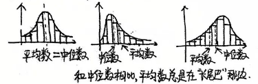

## 高中数学统计知识点留档

首先感谢我的数学老师

### 分布列、均值、方差

#### 一、分布列

##### 1. 随机变量

对于随机试验的样本空间$\Omega$中的每个样本点$\omega$，都有唯一的实数$X(\omega)$与之对应，称$X$为随机变量。  
注：  
① 样本点-数量化：与数值有关的，直接对应；与数值没有直接关系的，赋值。  
② 试验之前可列出所有值，但不能确定具体取值。

##### 2. 离散型随机变量

随机变量取值为有限个或可以一一列举出来。

##### 3. 求分布列的步骤

1. 随机变量可能取值
2. 每个取值的概率
3. 列表

##### 4. 分布列的性质

① $p_i\geq0$；② $\sum_{i}p_i=1$。

##### 5. 均值（数学期望）

$E(X)=\sum_{i}x_ip_i$

##### 6. 方差

$D(X)=\sum_{i}(x_i-E(X))^2p_i=E(X^2)-(E(X))^2$

:::note
$$
\begin{aligned}
D(X)
&= E\left[(X-E(X))^2\right] \\
&= E\left[X^2 - 2X\cdot E(X) + (E(X))^2\right] \\
&= E(X^2) - E\big[2X\cdot E(X)\big] + E\big[(E(X))^2\big] \\
&= E(X^2) - 2E(X)\cdot E(X) + (E(X))^2 \\
&= E(X^2) - 2[E(X)]^2 + [E(X)]^2 \\
&= E(X^2) - [E(X)]^2
\end{aligned}
$$
:::

##### 7. 期望与方差的运算性质

$E(aX+b)=aE(X)+b$；$D(aX+b)=a^2D(X)$

##### 8. 伯努利试验

- 伯努利试验：只包含两个可能结果的试验叫伯努利试验。
- $n$重伯努利实验：将一个伯努利试验独立地重复进行$n$次所组成的随机试验，叫$n$重伯努利实验。

#### 二、常见分布列

##### 1. 两点分布（0-1分布）

| $X$ | 0 | 1 |
| ---- | ---- | ---- |
| $P$ | $1-p$ | $p$ |

$E(X)=p$；$D(X)=p(1-p)$

##### 2. 二项分布

① 在$n$重伯努利试验中，设每次试验中事件$A$发生的概率为$p$，$A$发生的次数为$X$，则$X$服从二项分布，记作$X\sim B(n,p)$。  
② $P(X=k)=\mathrm{C}_{n}^{k}p^k(1-p)^{n-k}$（$k=0,1,2,\dots,n$）  
③ $E(X)=np$；$D(X)=np(1-p)$（会推导）  
④ 图像（以$A$出现次数为横坐标，概率为纵坐标）规律：

- 当$p=0.5$时，图像对称；
- 当$p>0.5$时，图像右偏；
- 当$p<0.5$时，图像左偏；
- $k$从$0$增到$n$，则$P(X=k)$先增后减。

:::note
$$
\begin{align*}
E(X) &= \sum_{k=0}^n k \cdot P(X=k) \\
&= \sum_{k=0}^n k \cdot \mathrm{C}_n^k p^k (1-p)^{n-k} \\
&= \sum_{k=1}^n k \cdot \frac{n!}{k!(n-k)!} p^k (1-p)^{n-k} \\
&= \sum_{k=1}^n \frac{n!}{(k-1)!(n-k)!} p^k (1-p)^{n-k} \\
&= np \sum_{k=1}^n \frac{(n-1)!}{(k-1)!(n-k)!} p^{k-1} (1-p)^{(n-1)-(k-1)} \\
&= np \sum_{m=0}^{n-1} \mathrm{C}_{n-1}^m p^m (1-p)^{(n-1)-m} \\
&= np \cdot [p + (1-p)]^{n-1} \\
&= np
\end{align*}

\begin{align*}
E(X^2) &= \sum_{k=0}^n k^2 \cdot \mathrm{C}_n^k p^k (1-p)^{n-k} \\
&= np \sum_{m=0}^{n-1} (m+1) \mathrm{C}_{n-1}^m p^m (1-p)^{(n-1)-m} \\
&= np \left[ (n-1)p + 1 \right] \\
&= n(n-1)p^2 + np \\
D(X) &= E(X^2) - [E(X)]^2 \\
&= n(n-1)p^2 + np - n^2p^2 \\
&= np - np^2 \\
&= np(1-p)
\end{align*}
$$
:::

##### 3. 求最值：求$P(X=k)$的最大值的方法

- 作商法
- 不等式法：
$\begin{cases}P(X=k)\geq P(X=k-1)\\P(X=k)\geq P(X=k+1)\end{cases}$
结论：$(n+1)p-1\leq k\leq (n+1)p$。

##### 4. 超几何分布

① 一批产品共$N$件，其中$M$件次品，从$N$件中抽取$n$件，用$X$表示抽取的$n$件产品中的次品数，则$X$服从超几何分布。
② $P(X=k)=\frac{\mathrm{C}_{M}^{k}\mathrm{C}_{N-M}^{n-k}}{\mathrm{C}_{N}^{n}}$（$k=m,m+1,\dots,r$）
③ $E(X)=n\frac{M}{N}$；$D(X)=n\frac{M}{N}\left(1-\frac{M}{N}\right)\frac{N-n}{N-1}$

:::note
$$
\begin{aligned}
E(X)
&=\sum_{k} k \cdot \frac{\mathrm{C}_M^k \mathrm{C}_{N-M}^{n-k}}{\mathrm{C}_N^n} \\
&=\frac{1}{\mathrm{C}_N^n}\sum_{k} k\mathrm{C}_M^k \mathrm{C}_{N-M}^{n-k} \\
&=\frac{1}{\mathrm{C}_N^n}\sum_{k} M\mathrm{C}_{M-1}^{k-1} \mathrm{C}_{N-M}^{n-k} \\
&=\frac{M}{\mathrm{C}_N^n}\sum_{k} \mathrm{C}_{M-1}^{k-1} \mathrm{C}_{N-M}^{n-k} \\
&=\frac{M}{\mathrm{C}_N^n}\sum_{t} \mathrm{C}_{M-1}^{t} \mathrm{C}_{N-M}^{(n-1)-t} \\
&=\frac{M}{\mathrm{C}_N^n}\mathrm{C}_{N-1}^{n-1} \\
&=\frac{M}{\dfrac{N!}{n!(N-n)!}}\cdot \dfrac{(N-1)!}{(n-1)!(N-n)!} \\
&=\frac{M\cdot n!(N-n)!\cdot(N-1)!}{N!\cdot(n-1)!(N-n)!} \\
&=\frac{Mn}{N}
\end{aligned}

\begin{aligned}
D(X)
&= E(X^2)-[E(X)]^2
= E[X(X-1)+X]-\left(\frac{nM}{N}\right)^2
= E[X(X-1)]+E(X)-\left(\frac{nM}{N}\right)^2,\\
E[X(X-1)]
&=\sum_{k}k(k-1)\cdot\frac{\mathrm{C}_M^k\mathrm{C}_{N-M}^{n-k}}{\mathrm{C}_N^n}
=\frac{1}{\mathrm{C}_N^n}\sum_{k}k(k-1)\mathrm{C}_M^k\mathrm{C}_{N-M}^{n-k}\\
&=\frac{1}{\mathrm{C}_N^n}\sum_{k}M(M-1)\mathrm{C}_{M-2}^{k-2}\mathrm{C}_{N-M}^{n-k}
=\frac{M(M-1)}{\mathrm{C}_N^n}\sum_{k}\mathrm{C}_{M-2}^{k-2}\mathrm{C}_{N-M}^{n-k}\\
&=\frac{M(M-1)}{\mathrm{C}_N^n}\mathrm{C}_{N-2}^{n-2}
=\frac{M(M-1)}{\mathrm{C}_N^n}\cdot\frac{(N-2)!}{(n-2)!(N-n)!}\\
&=\frac{M(M-1)\cdot (N-2)! \cdot n!(N-n)!}{N!\cdot (n-2)!(N-n)!}
=\frac{n(n-1)M(M-1)}{N(N-1)},\\
D(X)
&=\frac{n(n-1)M(M-1)}{N(N-1)}+\frac{nM}{N}-\frac{n^2M^2}{N^2}\\
&=\frac{nM}{N}\left[\frac{(n-1)(M-1)}{N-1}+1-\frac{nM}{N}\right]\\
&=\frac{nM}{N}\cdot\frac{N(n-1)(M-1)+N(N-1)-nM(N-1)}{N(N-1)}\\
&=\frac{nM(N-M)}{N^2}\cdot\frac{N-n}{N-1}
=\frac{nM}{N}\left(1-\frac{M}{N}\right)\frac{N-n}{N-1}.
\end{aligned}
$$
:::

##### 5. 超几何分布与二项分布的区分

- 原理：由古典概型得出超几何分布，由独立重复试验得出二项分布；  
    抽样方式：放回摸球是二项分布，不放回摸球是超几何分布；  
    近似情况：对于不放回摸球，当$N$充分大、且$n$远小于$N$时，各次抽样结果彼此影响很小，可近似认为独立，此时超几何分布可以用二项分布近似；  
    适用场景：当$n$较小时，用超几何分布处理；当$n$较大时，用二项分布近似。  
    近似二项分布的情况：
    1. 频率替代概率
    2. 总体未给出或总体很大
    3. 事件独立且概率不变
- 对于同一个模型，两个分布的均值相等，但超几何分布的方差较小，说明这个分布中随机变量的取值更集中于均值附近。  

##### 6. 正态分布

① 若随机变量$X$的概率分布密度函数$f(x)=\frac{1}{\sqrt{2\pi}\sigma}e^{-\frac{(x-\mu)^2}{2\sigma^2}}$，则称$X$服从正态分布，记作$X\sim N(\mu,\sigma^2)$。  
② 正态曲线的特点：  
1° 曲线位于$x$轴上方，与$x$轴不相交；  
2° 曲线是单峰的，关于$x=\mu$对称，最高点坐标为$(\mu,\frac{1}{\sqrt{2\pi}\sigma})$；  
3° 曲线与$x$轴之间区域的面积为$1$；  
4° $\sigma$越大，图象越“胖”；$\sigma$越小，图象越“瘦高”。  
③ 概率公式：  
$P(\mu-\sigma\leq X\leq \mu+\sigma)=0.6827$  
$P(\mu-2\sigma\leq X\leq \mu+2\sigma)=0.9545$  
$P(\mu-3\sigma\leq X\leq \mu+3\sigma)=0.9973$

### 随机抽样、数字特征

#### 一、随机抽样

##### 1. 统计学获取数据的途径

调查、试验、观察、查询

##### 2. 调查方法

- 全面调查（普查）
  - 普查所获数据更全面、系统，但费时费力、成本高
- 抽样调查
  - 抽查获取信息不全面，但大量检验，尤其是破坏性试验，抽样更好

##### 3. 常用的随机抽样方法

简单随机抽样，分层随机抽样

使用条件：总体是否由差异明显的几部分组成

##### 4. 简单随机抽样的方法

- 抽签法：编号、制签、搅匀、抽签、取样
- 随机数法：编号、产生随机数、选号，选定样本

##### 5. 不放回简单随机抽样的特征

有限性、逐一性、不放回性、等可能性

##### 6. 分层随机抽样的考要点

分层、求比、求每层的样本空间、对每层进行简单随机抽样、定样

##### 7. 分层随机抽样样本均值/方差公式

设第一层样本量为$m$，平均数为$\bar{x}$，方差为$s_1^2$；第二层样本量为$n$，平均数为$\bar{y}$，方差为$s_2^2$，样本总平均数为$\bar{w}$，则：

- 样本平均数：
  $$\bar{w} = \frac{m}{m+n}\bar{x} + \frac{n}{m+n}\bar{y}$$
- 样本方差：
  $$s^2 = \frac{m}{m+n}\left[s_1^2 + (\bar{x} - \bar{w})^2\right] + \frac{n}{m+n}\left[s_2^2 + (\bar{y} - \bar{w})^2\right]$$

:::note
$$
\begin{aligned}
s^2 &= \frac{1}{m+n}\left[\sum_{i=1}^{m}(x_i - \bar{w})^2 + \sum_{j=1}^{n}(y_j - \bar{w})^2\right] \\
&= \frac{1}{m+n}\left[\sum_{i=1}^{m}(x_i - \bar{x} + \bar{x} - \bar{w})^2 + \sum_{j=1}^{n}(y_j - \bar{y} + \bar{y} - \bar{w})^2\right] \\
&= \frac{1}{m+n}\left[\sum_{i=1}^{m}(x_i - \bar{x})^2 + 2(\bar{x} - \bar{w})\sum_{i=1}^{m}(x_i - \bar{x}) + \sum_{i=1}^{m}(\bar{x} - \bar{w})^2 + \sum_{j=1}^{n}(y_j - \bar{y})^2 + \sum_{j=1}^{n}(\bar{y} - \bar{w})^2\right] \\
&= \frac{1}{m+n}\left[ms_1^2 + 2(\bar{x} - \bar{w})(m\bar{x} - m\bar{x}) + m(\bar{x} - \bar{w})^2 + ns_2^2 + \sum_{j=1}^{n}(\bar{y} - \bar{w})^2\right] \\
&= \frac{1}{m+n}\left[ms_1^2 + m(\bar{x} - \bar{w})^2 + ns_2^2 + n(\bar{y} - \bar{w})^2\right] \\
&= \frac{m}{m+n}\left[s_1^2 + (\bar{x} - \bar{w})^2\right] + \frac{n}{m+n}\left[s_2^2 + (\bar{y} - \bar{w})^2\right]
\end{aligned}
$$
:::

##### 8. 任意随机抽样中个体被抽到的概率

$$\frac{n}{N}$$

#### 二、数字特征

##### 1. 画频率分布直方图的步骤

① 求极差 ② 定组距与组数 ③ 将数据分组 ④ 列频率分布表 ⑤ 画图
> 频率分布直方图的纵坐标为$\frac{\text{频率}}{\text{组距}}$
> 在图中，$\text{频率} = \text{组距} \times \frac{\text{频率}}{\text{组距}} = \text{小长方形的面积}$

##### 2. 常用的统计图

条形图、折线图、扇形图、频率分布直方图、频数分布直方图

##### 3. 第$p$百分位数的定义

它使得这组数据中**至少有$p\%$的数据小于或等于这个值，且至少有$(100-p)\%$的数据大于或等于这个值**。

##### 4. 求$n$个数据的第$p$百分位数的步骤

① 从小到大排列原始数据  
② 计算$i = n \times p\%$  
③ 若$i$不是整数，而大于$i$的比邻整数为$j$（**向上取整**），则$P$分位数为第$j$项数据；  
   若$i$是整数，则$P$分位数为第$i$项与第$i+1$项数据的平均数。

##### 5. 中位数与四分位数

- 中位数相当于**第50百分位数**
- 四分位数分别是**第25百分位数、第50百分位数、第75百分位数**
  - 上四分位数是第**75**百分位数

:::warning
注意四分位数有$3$个
:::

##### 6. 平均数、中位数、极端值、方差的性质

- 平均数反映数据集中趋势，一数据的改变会影响平均数吗？**会**
- 中位数受极端值影响吗？**不受**
- 一组数据如何求中位数？从小到大排序，奇数个，为正中间的数；偶数个，为中间两数的平均数
- 方差反映数据离散程度
  $$s^2 = \frac{1}{n}\sum_{i=1}^{n}(x_i - \bar{x})^2 = \frac{1}{n}\sum_{i=1}^{n}x_i^2 - \bar{x}^2$$

:::note
$$
\begin{aligned}
s^2 &= \frac{1}{n}\sum_{i=1}^{n}(x_i - \bar{x})^2 = \frac{1}{n}\sum_{i=1}^{n}(x_i^2 - 2x_i\bar{x} + \bar{x}^2) \\
&= \frac{1}{n}\left(\sum_{i=1}^{n}x_i^2 - 2\bar{x}\sum_{i=1}^{n}x_i + n\bar{x}^2\right) \\
&= \frac{1}{n}\sum_{i=1}^{n}x_i^2 - 2\bar{x}^2 + \bar{x}^2 = \frac{1}{n}\sum_{i=1}^{n}x_i^2 - \bar{x}^2
\end{aligned}
$$
:::

##### 7. 平均数、中位数、众数的特点

- 在平均数、中位数、众数中，**平均数、中位数是唯一的**，众数一定是原数据中的数。
- 对数值型数据（如用水量、身高）集中趋势的描述，可以用**平均数、中位数**；
- 对分类型数据（如性别、校服规格）集中趋势的描述，可用**众数**。

##### 8. 描述数据离散程度的统计量

方差、标准差、极差

##### 9. 频率分布直方图中统计量求解

- 平均数：$\sum \text{组中值} \times \text{频率}$
- 第$p$百分位数：从左往右数，先数满格，不满的按比例补

:::note

1. 计算目标累计频率：$0.01p$
2. 从左往右累加频率，找到**首次累计频率 ≥ $0.01p$** 的那一组，记为：
   - 左端点：$L$
   - 组距：$w$
   - 本组频率：$f$
   - 前几组累计频率：$F$
3. 公式：

$$
\text{第}p\text{百分位数}
= L + w \cdot \frac{0.01p - F}{f}
$$
:::

- 中位数：第$50$百分位数
- 众数：最高一组的组中值（最高矩形底边中点横坐标）
- 方差

:::note
$$
s^2 = \sum (x_i - \bar{x})^2 f_i
$$

其中：

- $x_i$：各组组中值
- $f_i$：各组频率
- $\bar{x}$：上面算出的平均数

:::

:::note
一句话速记

- 众数：**最高矩形中点**
- 平均数：**组中值×频率 相加**
- 百分位数：**累计频率插值**
- 方差：**(组中值−均值)²×频率 相加**

:::

##### 10. 频率分布直方图形态与平均数、中位数的关系

在三种频率分布图形形态中，平均数与中位数的大小关系：

1. 对称形态：$\text{平均数} = \text{中位数}$
2. 右偏形态：$\text{中位数} < \text{平均数}$
3. 左偏形态：$\text{平均数} < \text{中位数}$

> 结论：和中位数相比，平均数总是在“长尾巴”那边。
