## 高中数学解析几何知识点留档

首先感谢我的数学老师

## 一、直线

### 1. 倾斜角

当直线$l$与$x$轴相交时，以$x$轴为基准，$x$轴正向与$l$向上的方向之间所成角$\alpha$。

- 规定：直线与$x$轴平行或重合时，倾斜角为$0$。
- 范围：$[0,\pi)$

### 2. 斜率

① 已知直线的倾斜角为$\alpha$，则斜率为：
$$k=\tan\alpha \quad (\alpha\neq\frac{\pi}{2})$$

② 已知直线上两点$P_1(x_1,y_1),\ P_2(x_2,y_2)$，则斜率为：
$$k=\frac{y_1-y_2}{x_1-x_2} \quad (x_1\neq x_2)$$

### 3. 倾斜角与斜率的关系

① 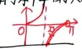

② 关系总结：

- $\alpha=0$，则$k=0$；
- $0<\alpha<\frac{\pi}{2}$，则$k>0$，且斜率随倾斜角的增加而增加；
- $\alpha=\frac{\pi}{2}$，则直线垂直于$x$轴（斜率不存在）；
- $\frac{\pi}{2}<\alpha<\pi$，则$k<0$，且斜率随倾斜角的增加而增加。

### 4. 平行与垂直

:::note
注：平面中“两条直线”，无特殊说明，指不重合的；若已知直线$l_1,l_2$，则其可能重合。
:::

① 已知$l_1:y=k_1x+b_1,\ l_2:y=k_2x+b_2$，则：
$$
\begin{align*}
l_1\parallel l_2 &\Leftrightarrow \begin{cases} k_1=k_2 \\ b_1\neq b_2 \end{cases} \\
l_1\perp l_2 &\Leftrightarrow k_1k_2=-1
\end{align*}
$$
② 已知$l_1:A_1x+B_1y+C_1=0,\ l_2:A_2x+B_2y+C_2=0$，则：

- $A_1B_2=A_2B_1$，则$l_1$与$l_2$的位置关系为**平行或重合**（需验证）；
- $l_1\perp l_2 \Leftrightarrow A_1A_2+B_1B_2=0$。

③ “两条直线平行”是“两条直线的斜率相等”的**既不充分也不必要条件**。

④ 平行/垂直/过交点的直线系：

- 与直线$Ax+By+C=0$平行的直线系为：$Ax+By+\lambda=0\ (\lambda\neq C)$；
- 与直线$Ax+By+C=0$垂直的直线系为：$Bx-Ay+\lambda=0$；
- 过直线$A_1x+B_1y+C_1=0$与$A_2x+B_2y+C_2=0$交点的直线系为：

$$(A_1x+B_1y+C_1)+\lambda(A_2x+B_2y+C_2)=0$$
（不包含$A_2x+B_2y+C_2=0$）

### 5. 直线方程

| 形式 | 方程 | 适用范围 |
| --- | --- | --- |
| 点斜式 | $y-y_0=k(x-x_0)$ | 过定点$(x_0,y_0)$，斜率存在 |
| 斜截式 | $y=kx+b$ | 斜率存在 |
| 截距式 | $\frac{x}{a}+\frac{y}{b}=1$ | 截距存在且不为零（即不垂直坐标轴，且不过原点） |
| 两点式 | $\frac{y-y_1}{y_2-y_1}=\frac{x-x_1}{x_2-x_1}$ | 不垂直坐标轴；改进式：$(y-y_1)(x_2-x_1)=(x-x_1)(y_2-y_1)$ |
| 一般式 | $Ax+By+C=0\ (A^2+B^2\neq0)$ | 所有直线 |
| 参数方程 | $\begin{cases}x=x_0+t\cos\alpha \\ y=y_0+t\sin\alpha\end{cases}$（$t$为参数） | 过定点$(x_0,y_0)$，$\alpha$为倾斜角；  $t$的几何意义：动点到定点的有向距离 |

② 截距与距离的区别：截距$\in\mathbb{R}$是坐标，有正负，距离$\ge0$。

- 直线的截距相等，则直线：$x+y=a (k=1)$ 或 $y=kx (\text{过}(0,0))$；
- 直线的截距的绝对值相等，则直线：$x+y=a (k=1)$ 或 $x-y=a (k=-1)$ 或 $y=kx (\text{过}(0,0))$。

③ 点到直线的距离：点$P(x_0,y_0)$到直线$l:Ax+By+C=0$的距离：
$$d=\frac{|Ax_0+By_0+C|}{\sqrt{A^2+B^2}}$$

:::note
直线方程需为标准的一般式。
:::

④ 两平行直线间的距离公式：
$$d=\frac{|C_2-C_1|}{\sqrt{A^2+B^2}}$$

:::note
两直线方程中$x,y$的系数要相同。
:::

### 6. 对称问题

① 点关于点对称：$A(x_1,y_1)$关于$P(x_0,y_0)$的对称点为$(2x_0-x_1,2y_0-y_1)$。

② 点关于线对称：$A(x_0,y_0)$关于$l:Ax+By+C=0$的对称点为：

$$
A'\left(x_0-2A\cdot\frac{Ax_0+By_0+C}{A^2+B^2},\ y_0-2B\cdot\frac{Ax_0+By_0+C}{A^2+B^2}\right)
$$

:::note
求解思路：线段$AA'$的中点在$l$上，且$AA'\perp l$。

特别地，当直线的斜率为$\pm1$时，如$l:y=x+b$，则对称点为$(y_0-b,x_0+b)$。
:::

③ 线关于点对称（点不在线上）：$l:Ax+By+C=0$关于$P(x_0,y_0)$的对称线为：

$$
Ax+By-2Ax_0-2By_0-C=0
$$

:::note
求解思路：

- 方法1：设$l' \parallel l$，即$l':Ax+By+\lambda=0\ (\lambda\neq C)$，利用$P$到$l,l'$的距离相等；
- 方法2：在$l$上任取两个点，求其关于$P$的对称点，再求直线方程；
- 方法3：直接法，设$l$上任一点$A(x,y)$，关于$P$的对称点$A'(2x_0-x,2y_0-y)$在$l'$上，代入方程化简。

:::

④ 线关于线对称（两线不重合）：**求解思路：特殊点法、直接法**。

⑤ 镜面反射问题：常用“**入射光线上的点关于镜面的对称点在反射光线的反向延长线上**”。

⑥ 利用对称求最值

- 点$A,B$在直线$l$同侧，在$l$上找一点$P$：使$|PA|+|PB|$最小（对称点连线与$l$交点）；使$||PA|-|PB||$最大（延长线与$l$交点）。
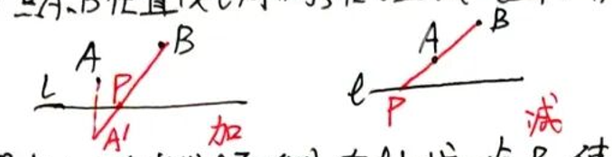
- 点$A,B$在直线$l$两侧，在$l$上找一点$P$：使$|PA|+|PB|$最小（直接连线与$l$交点）；使$||PB|-|PA||$最大（对称点连线与$l$交点）。
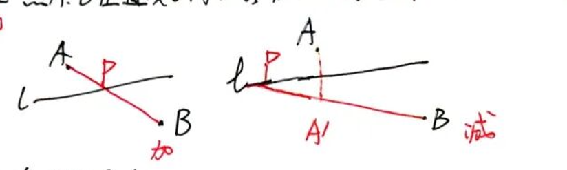

:::note
三点共线求最值+对称转化
:::

### 7. 直线过定点

求定点的方法：

- 方法1：化成点斜式；
- 方法2：化成$f(x,y)+\lambda g(x,y)=0$，则$\begin{cases}f(x,y)=0 \\ g(x,y)=0\end{cases}$的解即为定点。

:::note
适用场景：含参数的一次式。
:::

### 8. 直线的方向向量

① 定义：向量所在直线与已知直线平行或重合。
② 直线$y=kx+b$的方向向量为$(1,k)$；
直线$Ax+By+C=0$的方向向量为$(B,-A)$。

### 9. 证明三点共线的方法

1. 斜率相等且有公共点；
2. 向量共线且有公共点；
3. $|AB|+|BC|=|AC|$(若$B$在$AC$中间)。

---

## 二、圆

### 1. 圆的方程

- 标准式：$(x-a)^2+(y-b)^2=r^2$；
- 一般式：$x^2+y^2+Dx+Ey+F=0\ (D^2+E^2-4F>0)$，圆心$\left(-\frac{D}{2},-\frac{E}{2}\right)$，半径$\frac{1}{2}\sqrt{D^2+E^2-4F}$；
- 参数方程：$\begin{cases}x=a+r\cos\theta \\ y=b+r\sin\theta\end{cases}$（$\theta$为参数），$(a,b)$为圆心，$r$为半径；
- 以$A(x_1,y_1),B(x_2,y_2)$为直径的圆的方程：$(x-x_1)(x-x_2)+(y-y_1)(y-y_2)=0$。

① 二元二次方程$Ax^2+Bxy+Cy^2+Dx+Ey+F=0$表示圆的条件：
$$\begin{cases} A=C\neq0 \\ B=0 \\ (\frac{D}{A})^2+(\frac{E}{A})^2-4\frac{F}{A}>0 \end{cases}$$

② $x^2+y^2+Dx+Ey+F=0$表示点的条件：$D^2+E^2-4F=0$，其点为$\left(-\frac{D}{2},-\frac{E}{2}\right)$。

### 2. 直线与圆的位置关系

（圆心到直线的距离为$d$，半径为$r$）

① 几何关系：

- 相离：$d>r$；
- 相切：$d=r$；
- 相交：$d<r$。

② 研究方法：代数联立法、几何法（常用）。

- 若直线过圆内一点，则直线与圆**相交**；
- 若直线过圆上一点，则直线与圆**相切或相交**。

③ 常用结论：

- 直线与圆相切时：$CN\perp l$，$CN=r$（$N$为切点）；
- 直线与圆相交时：$CQ\perp MN$（垂径定理，$Q$为弦$MN$中点）。

### 3. 切线

① 切线方程：

- 过圆$x^2+y^2=r^2$上一点$P(x_0,y_0)$的切线方程：$x_0x+y_0y=r^2$；
- 过圆$(x-a)^2+(y-b)^2=r^2$上一点$P(x_0,y_0)$的切线方程：$(x_0-a)(x-a)+(y_0-b)(y-b)=r^2$；
- 过圆$x^2+y^2+Dx+Ey+F=0$上一点$P(x_0,y_0)$的切线方程：
$$x_0x+y_0y+D\cdot\frac{x+x_0}{2}+E\cdot\frac{y+y_0}{2}+F=0$$

② 切线条数：

- 过圆上一点，有**1条**切线；
- 过圆外一点，有**2条**切线。

:::warning
求切线方程时，需先判断点与圆的位置关系，再决定切线的条数

方法：①设斜截式（斜率存在时），②点到切线的距离等于半径。
:::

### 4. 点与圆的位置关系

已知$P(x_0,y_0)$，圆$C:x^2+y^2=r^2$，则：

- $P$在$C$上 $\Leftrightarrow x_0^2+y_0^2=r^2$；
- $P$在$C$内 $\Leftrightarrow x_0^2+y_0^2<r^2$；
- $P$在$C$外 $\Leftrightarrow x_0^2+y_0^2>r^2$。

### 5. 圆与圆的位置关系

（圆心距$d$，两圆半径$r_1,r_2$）

① 几何关系：

- 相离：$d>r_1+r_2$；
- 外切：$d=r_1+r_2$；
- 相交：$|r_1-r_2|<d<r_1+r_2$；
- 内切：$d=|r_1-r_2|$；
- 内含：$d<|r_1-r_2|$。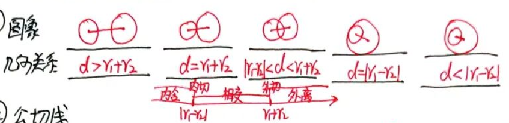

② 公切线条数：

- 两圆相离：4条；
- 两圆外切：3条；
- 两圆相交：2条；
- 两圆内切：1条。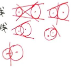

③ 相交/相切的结论：

- 两圆相交时，相交弦所在直线方程为**两圆方程相减**；相交弦的中垂线方程为**两圆心所在直线**；
- 两圆相切时，切点、两圆心三点共线。

### 6. 与圆有关的最值问题

（以$(x-a)^2+(y-b)^2=r^2$为例）

- ① $z=\frac{y-m}{x-n}$：点$(n,m)$与圆上点$Q(x,y)$的连线的斜率，临界情况为过$P$的圆的切线；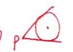
- ② $z=mx+ny$：纵截距$y=-\frac{m}{n}x+\frac{z}{n}$；
- ③ $z=(x-m)^2+(y-n)^2$：点$(m,n)$到圆上点$Q$的距离的平方；
- ④ 过圆内一点$P(m,n)$，最长弦为**直径**$|CD|$，最短弦为**垂直于直径的弦**$|AB|$。

总结：有关圆的最值问题，数形结合时向**圆心**靠拢；代数法常用**三角换元**。

### 7. 阿波罗尼斯圆

- ① 定义：在平面上，给定相异的两点$A,B$，设$P$在同一平面上，满足$|PA|=\lambda|PB|\ (\lambda\neq1)$，则$P$的轨迹是个圆。
- ② 若$|AB|=a$，$|PA|=\lambda|PB|\ (\lambda>0,\lambda\neq1)$，则半径$r=\frac{\lambda a}{|\lambda^2-1|}$。

---

## 三、椭圆

### 1. 椭圆定义

① 第一定义：已知$F_1,F_2$为两定点，$P$是动点，满足：
$$
|PF_1|+|PF_2|=2a>2c=|F_1F_2|
$$
焦距为$2c$，长轴长为$2a$；

当常数$=|F_1F_2|$时，$P$的轨迹为线段$F_1F_2$。

② 第二定义：动点$M$与定点$F$的距离和$M$到定直线$l$的距离的比是常数$e(0<e<1)$，则$M$的轨迹为椭圆。

:::note
左焦点对应右准线，右焦点对应左准线
:::

若$P(x_0,y_0)$是$\frac{x^2}{a^2}+\frac{y^2}{b^2}=1\ (a>b>0)$上一点，则：$|PF_1|=a+ex_0,\quad |PF_2|=a-ex_0$

③ 第三定义：$A(-a,0),\ B(a,0)$，直线$AM,BM$交于$M$，且$k_{AM}\cdot k_{BM}=-\frac{b^2}{a^2}$，则$M$的轨迹为**去掉$A,B$两点**的椭圆。

推广：$A,B$为关于原点对称的两点，$k_{AM}\cdot k_{BM}=-\frac{b^2}{a^2}$，则$M$的轨迹为**去掉$A,B$两点**的椭圆。

### 2. 椭圆标准方程

① $\frac{x^2}{a^2}+\frac{y^2}{b^2}=1\ (a>b>0)$ 或 $\frac{y^2}{a^2}+\frac{x^2}{b^2}=1\ (a>b>0)$；

:::note
焦点位置判断口诀：“**谁大在谁上**”

求椭圆标准方程要先定焦点位置，再定量
:::

② 统一方程：$mx^2+ny^2=1\ (m>0,n>0,m\neq n)$，常用于过两点求椭圆方程。

③ 参数方程：$\begin{cases}x=a\cos\theta \\ y=b\sin\theta\end{cases}$（$\theta$为参数）。

④ 共焦点椭圆方程：

- 与$\frac{x^2}{a^2}+\frac{y^2}{b^2}=1\ (a>b>0)$有相同焦点的椭圆方程：$\frac{x^2}{a^2+k}+\frac{y^2}{b^2+k}=1\ (k>-b^2)$；
- 与$\frac{x^2}{a^2}-\frac{y^2}{b^2}=1\ (a>0,b>0)$有相同焦点的椭圆方程：$\frac{x^2}{a^2+k}+\frac{y^2}{k-b^2}=1\ (k>b^2)$。

### 3. 椭圆的常用结论

① 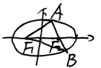 $\triangle ABF_2$的周长为$4a$（$AB$过$F_1$）。

② 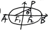焦点三角形$PF_1F_2$：

- 常用结论：椭圆定义、余弦定理、面积公式；
- 面积：$S_{\triangle PF_1F_2}=b^2\tan\frac{\theta}{2}$；
- $|PF_1|\cdot|PF_2|=\frac{2b^2}{1+\cos\theta}$（推导：由余弦定理$(2c)^2=|PF_1|^2+|PF_2|^2-2|PF_1||PF_2|\cos\theta$，结合$|PF_1|+|PF_2|=2a$，化简得$|PF_1|\cdot|PF_2|=\frac{2b^2}{1+\cos\theta}$）；
- $P$从$A$到$B$运动时，$\theta$先变大后变小，$S_{\triangle PF_1F_2}$先变大后变小。

③ 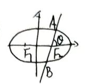焦点弦：

- $|F_2A|=\frac{b^2}{a+c\cos\theta},\ |F_2B|=\frac{b^2}{a-c\cos\theta}$，$|AB|=\frac{2b^2}{1-e^2\cos^2\theta}$；
- $\frac{1}{|F_2A|}+\frac{1}{|F_2B|}=\frac{2a}{b^2}$；
- 通径：过焦点垂直于长轴的弦，长为$\frac{2b^2}{a}$；是过焦点的弦中最短的弦，最长的弦为长轴；
- 焦半径$r$的范围：$[a-c,a+c]$；
- $P$在右顶点时$|PF_1|$最大，在左顶点时$|PF_1|$最小。

④ 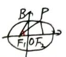离心率：

- $e=\frac{c}{a}=\sqrt{1-\frac{b^2}{a^2}}=\frac{|F_1F_2|}{|PF_1|+|PF_2|}=\cos\angle BF_1O$
- $e$越大，椭圆越扁；

:::note
记忆方法：$a$不变，$e$越大，$\frac{b^2}{a}$越小，$b$越小，椭圆越扁。
:::

- $e\in(0,1)$。

⑤ 光学性质：由一个焦点射向椭圆上任意一点的光线，经椭圆反射后必过椭圆的另一焦点。

### 4. 点与椭圆的位置关系

（$P(x_0,y_0)$，椭圆$\frac{x^2}{a^2}+\frac{y^2}{b^2}=1$）

- 点在椭圆上 $\Leftrightarrow \frac{x_0^2}{a^2}+\frac{y_0^2}{b^2}=1 \Leftrightarrow |PF_1|+|PF_2|=2a$；
- 点在椭圆内 $\Leftrightarrow \frac{x_0^2}{a^2}+\frac{y_0^2}{b^2}<1 \Leftrightarrow |PF_1|+|PF_2|<2a$；
- 点在椭圆外 $\Leftrightarrow \frac{x_0^2}{a^2}+\frac{y_0^2}{b^2}>1 \Leftrightarrow |PF_1|+|PF_2|>2a$。

:::note
类比圆
:::

② 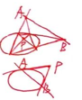直线$\frac{x_0x}{a^2}+\frac{y_0y}{b^2}=1$的几何意义：

- 若$P$在椭圆上，$l$表示在$P$处的切线；
- 若$P$在椭圆内，$l$表示中点弦所在直线；
- 若$P$在椭圆外，$l$表示切点弦所在直线；
- 特别地，当$P$为焦点时，$l$为准线。

### 5. 直线与椭圆

① 位置关系：相离、相交、相切，判断方法：联立方程，判别式$\Delta$。

② 弦长公式：直线$l:y=kx+m$与椭圆$C:\frac{x^2}{a^2}+\frac{y^2}{b^2}=1\ (a>b>0)$交于$P(x_1,y_1),Q(x_2,y_2)$：

联立方程得：$(a^2k^2+b^2)x^2+2a^2kmx+a^2m^2-a^2b^2=0$，则：
$$
\begin{align*}
|PQ|&=\sqrt{1+k^2}|x_1-x_2|=\sqrt{1+\frac{1}{k^2}}|y_1-y_2| \\
&=\sqrt{1+k^2}\cdot\sqrt{(x_1+x_2)^2-4x_1x_2} \\
&=\sqrt{1+k^2}\cdot\frac{2ab\sqrt{a^2k^2+b^2-m^2}}{a^2k^2+b^2}
\end{align*}
$$

③ 直线的设法：

- 设为$x=ty+n$：过$x$轴上的定点，使用条件：斜率不为0；
- 设为$y=kx+b$：过$y$轴上的定点，使用条件：斜率存在。

### 6. 最值问题

① 求椭圆上的点到定直线的距离的最值的方法：椭圆的参数方程、平行直线系（常用参数方程）。

② 定点与椭圆上点的最值：

- 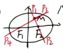$P$为椭圆上一点，$M$为椭圆内一定点：
  - $|PM|+|PF_1|$的最值：$[2a-|MF_2|,2a+|MF_2|]$；
  - $||PM|-|PF_1||$的最值：$[-|MF_1|,|MF_1|]$；
- 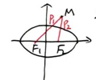$P$为椭圆上一点，$M$为椭圆外一定点：
  - $|PM|+|PF_1|$的最小值：$|MF_2|$；
  - $|PM|-|PF_1|$的最小值：$|PM|-2a+|PF_2|$；
- 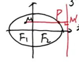$P$为椭圆$\frac{x^2}{a^2}+\frac{y^2}{b^2}=1$上一点，$M$为椭圆内一定点，求$|PM|+\frac{c}{a}|PF_2|$的最小值：
  - 利用第二定义，$\frac{|PF_2|}{d}=e=\frac{c}{a}$，即$\frac{c}{a}|PF_2|=d$（$d$为$P$到右准线的距离），转化为$|PM|+d$的最小值。

### 7. 过原点的直线交椭圆于$A,B$两点

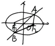由椭圆的对称性知，四边形$AF_1BF_2$为平行四边形。

### 8. 中点弦性质

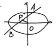直线$AB$与椭圆交于$A,B$两点，$P$为线段$AB$的中点，则：
$$k_{AB}\cdot k_{OP}=-\frac{b^2}{a^2}$$

### 9. 直线与椭圆位置关系的常用方法

设而不求、点差法（中点问题优先考虑点差法）。

### 10. 求范围问题

常用：$\Delta>0$、$|x|\le a$且$|y|\le b$、$e\in(0,1)$。

### 11. 求离心率的值或范围

常用：数形结合、齐次式、点在椭圆上。

### 12. 焦点问题

焦点常成对出现，不足时补齐；有关焦点的问题要考虑定义。

### 13. 焦点弦与准线的位置关系

以过椭圆的焦点的弦为直径的圆与其相应的准线相离。

---

## 四、双曲线

### 1. 双曲线定义

① 第一定义：已知$F_1,F_2$是两定点，$P$是动点，符号表示为：
$$
||PF_1|-|PF_2||=2a<|F_1F_2|=2c
$$
焦距为$2c$，实轴长为$2a$；

当常数$=|F_1F_2|$时，$P$的轨迹为以$F_1,F_2$为端点的两条射线。

② 第二定义：动点$M$与定点$F$的距离和$M$到定直线$l$的距离的比是常数$e(e>1)$，则$M$的轨迹为双曲线。

:::note

- 注意：左焦点对应左准线，右焦点对应右准线。
- 若$M(x_0,y_0)$是$\frac{x^2}{a^2}-\frac{y^2}{b^2}=1\ (a>0,b>0)$上一点，则：
  $$|PF_1|=|a+ex_0|,\quad |PF_2|=|a-ex_0|$$
- 求焦半径常用方法是**第二定义**；焦半径范围为$[c-a,+\infty)$。

:::

③ 第三定义：$A(-a,0),B(a,0)$，$k_{AM}\cdot k_{BM}=\frac{b^2}{a^2}$，则$M$的轨迹为去掉$A,B$两点的双曲线。

:::note
整合：已知$A(-a,0),B(a,0)$，动点$M$满足$k_{MA}\cdot k_{MB}=e^2-1$：

- 若$e\in(0,1)$，则$M$的轨迹为去掉$A,B$的椭圆；
- 若$e\in(1,+\infty)$，则$M$的轨迹为去掉$A,B$的双曲线。

:::

### 2. 双曲线标准方程

① 标准方程：$\frac{x^2}{a^2}-\frac{y^2}{b^2}=1\ (a>0,b>0)$ 或 $\frac{y^2}{a^2}-\frac{x^2}{b^2}=1\ (a>0,b>0)$。

:::note
焦点位置判断口诀：**谁正就在谁上**；

求双曲线标准方程要先定焦点位置后定量。
:::

② 统一方程：$mx^2+ny^2=1\ (mn<0)$；焦点在$x$轴上满足条件：$m>0,n<0$。

③ 共焦点方程：

- 与$\frac{x^2}{a^2}+\frac{y^2}{b^2}=1\ (a>b>0)$共焦点的双曲线方程：$\frac{x^2}{a^2-k}-\frac{y^2}{k-b^2}=1\ (b^2<k<a^2)$；
- 与$\frac{x^2}{a^2}-\frac{y^2}{b^2}=1\ (a>0,b>0)$共焦点的双曲线方程：$\frac{x^2}{a^2+k}-\frac{y^2}{b^2-k}=1\ (-a^2<k<b^2)$。

### 3. 常用结论

① 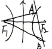$\triangle ABF_2$的周长为$4a+2|AB|$（$AB$过$F_1$且交双曲线于同一支）。

② 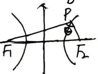焦点$\triangle PF_1F_2$：

- 研究时常用到**双曲线定义、余弦定理、面积公式**；
- 面积：$S_{\triangle PF_1F_2}=\frac{b^2}{\tan\frac{\theta}{2}}$；
- $|PF_1|\cdot|PF_2|=\frac{2b^2}{1-\cos\theta}$；
- 圆$M$为$\triangle PF_1F_2$的内切圆，则$M$的横坐标为$a$（推导：$|PF_1|-|PF_2|=|GF_1|-|EF_2|=(x_P+c)-(c-x_P)=2x_P=2a$，故$x_P=a$）。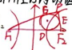

③ 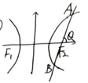焦点弦：

- $|F_1A|=\frac{b^2}{1-e\cos\theta},\ |F_1B|=\frac{b^2}{1+e\cos\theta}$，$|AB|=\frac{2b^2}{1-e^2\cos^2\theta}$；
- $\frac{1}{|F_1A|}+\frac{1}{|F_1B|}=\frac{2a}{b^2}$；
- 通径长为$\frac{2b^2}{a}$。

④ 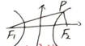离心率：
$$e=\frac{c}{a}=\sqrt{1+\frac{b^2}{a^2}}=\frac{||PF_1|-|PF_2||}{|F_1F_2|}$$
$e$越大，双曲线开口越**大**

:::note
理解方法：$e$越大，$\frac{b}{a}$越大，渐近线斜率越大。
:::

⑤ 光学性质：由双曲线一个焦点射出的光线，在双曲线上发生反射后，反射光线的**反向延长线经过双曲线的另一个焦点**。

⑥ 渐近线：

- $\frac{x^2}{a^2}-\frac{y^2}{b^2}=1\ (a>0,b>0)$的渐近线方程为：$y=\pm\frac{b}{a}x$；
- $\frac{y^2}{a^2}-\frac{x^2}{b^2}=1\ (a>0,b>0)$的渐近线方程为：$y=\pm\frac{a}{b}x$；
- $mx^2-ny^2=1\ (mn>0)$的渐近线方程为：$mx^2-ny^2=0$

:::note
方法：将“1”变为“0”
:::

- 渐近线为$y=\pm\frac{n}{m}x\ (m>0,n>0)$的双曲线方程可设为：$\frac{y^2}{n^2}-\frac{x^2}{m^2}=\lambda\ (\lambda\neq0)$；
- 与$\frac{x^2}{a^2}-\frac{y^2}{b^2}=1\ (a>0,b>0)$有相同渐近线的双曲线方程为：$\frac{x^2}{a^2}-\frac{y^2}{b^2}=\lambda\ (\lambda\neq0)$；
- 焦点到一条渐近线的距离为$b$。

### 4. 特殊双曲线

① 等轴双曲线：

- 定义：实轴等于虚轴；
- 渐近线方程：$y=\pm x$，夹角为$\frac{\pi}{2}$；
- 离心率：$e=\sqrt{2}$；
- 方程可设为：$x^2-y^2=\lambda\ (\lambda\neq0)$。

② 共轭双曲线：

- 定义：实轴、虚轴互换；
- 互为共轭的双曲线的渐近线方程**相同**；满足$\frac{1}{e_1^2}+\frac{1}{e_2^2}=1$，四焦点共圆；
- $\frac{x^2}{a^2}-\frac{y^2}{b^2}=1\ (a>0,b>0)$的共轭双曲线方程为：$\frac{x^2}{a^2}-\frac{y^2}{b^2}=-1$。

③ 反比例函数$y=\frac{k}{x}(k\neq0)$：

- 实轴长为$2\sqrt{2|k|}$；
- 渐近线方程为$x=0,y=0$；
- 离心率为$\sqrt{2}$；
- 函数$y=x+\frac{k}{x}(k>0)$的渐近线方程为$y=x,x=0$，离心率为$\sqrt{4-2\sqrt{2}}$。

### 5. 直线与双曲线

① 过定点$P$与双曲线只有一个交点的直线条数：

- 当定点 P 在①内，过 P 与双曲线只有一个交点的直线有2条
- 当定点 P 在②内，过 P 与双曲线只有一个交点的直线有4条
- 当定点 P 在③内，过 P 与双曲线只有一个交点的直线有4条
- 当定点 P 在双曲线上，过 P 与双曲线只有一个交点的直线有3条
- 当定点 P 在渐近线上，过 P 与双曲线只有一个交点的直线有2条
- 当定点 P 在原点上，过 P 与双曲线只有一个交点的直线有0条

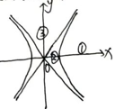

② 直线$l:y=kx+m$与双曲线$C:\frac{x^2}{a^2}-\frac{y^2}{b^2}=1\ (a>0,b>0)$交于$P(x_1,y_1),Q(x_2,y_2)$：

联立方程得：$(b^2-a^2k^2)x^2-2a^2kmx-a^2m^2-a^2b^2=0$，$\Delta=4a^4b^2(b^2-a^2k^2+m^2)$。

- 当$b^2-a^2k^2=0$或$\Delta=0$时，$l$与$C$只有一个交点；
- 当$\begin{cases}b^2-a^2k^2\neq0 \\ \Delta>0\end{cases}$时，$l$与$C$有两个不同交点；
- 当$\begin{cases}b^2-a^2k^2\neq0 \\ \Delta>0 \\ x_1x_2=\frac{-a^2(m^2+b^2)}{b^2-a^2k^2}>0\end{cases}$时，$l$与$C$同支交于两点；
- 当$\begin{cases}b^2-a^2k^2\neq0 \\ x_1x_2=\frac{-a^2(m^2+b^2)}{b^2-a^2k^2}<0\end{cases}$时，$l$与$C$交于不同两支。

③ 切线：

- 已知双曲线$C:\frac{x^2}{a^2}-\frac{y^2}{b^2}=1\ (a>0,b>0)$，点$P(x_0,y_0)$：
  1. 若$P$在$C$上，则$P$处的切线方程为：$\frac{x_0x}{a^2}-\frac{y_0y}{b^2}=1$；
  2. 若$P$在$C$外，过$P$引$C$的两条切线，则切点弦方程为：$\frac{x_0x}{a^2}-\frac{y_0y}{b^2}=1$；
  3. $C$与直线$Ax+By+C=0$相切的条件是：$B^2b^2-A^2a^2+C^2=0$。

④ 中点弦性质：设$M(x_0,y_0)$为双曲线$\frac{x^2}{a^2}-\frac{y^2}{b^2}=1\ (a>0,b>0)$的弦$AB$（$AB$不平行$y$轴）的中点，则$k_{AB}\cdot k_{OM}=\frac{b^2}{a^2}$；

过原点的直线交双曲线于$A,B$，$P$是双曲线上任一点，则$k_{PA}\cdot k_{PB}=\frac{b^2}{a^2}$。

⑤ 以过双曲线的焦点的弦为直径的圆与其相应的准线**相交**。

---

## 五、抛物线

### 1. 抛物线定义

- 动点$P$到定点$F$和定直线$l$的距离相等（$F\notin l$），则$P$的轨迹为抛物线；
- 当$F\in l$时，$P$的轨迹为过$F$且垂直于$l$的直线。

### 2. 抛物线标准方程

（$p>0$）

| 方程 | $y^2=2px$ | $y^2=-2px$ | $x^2=2py$ | $x^2=-2py$ |
| ------ | ----------- | ------------ | ----------- | ------------ |
| 焦点坐标 | $(\frac{p}{2},0)$ | $(-\frac{p}{2},0)$ | $(0,\frac{p}{2})$ | $(0,-\frac{p}{2})$ |
| 准线方程 | $x=-\frac{p}{2}$ | $x=\frac{p}{2}$ | $y=-\frac{p}{2}$ | $y=\frac{p}{2}$ |

:::note
焦点坐标中非零值是一次项系数的$\frac{1}{4}$；准线方程中的数值是一次项系数的$-\frac{1}{4}$；

求焦点坐标或准线方程，需先把抛物线方程化为标准式，**谁是一次项，焦点在谁上**。
:::

### 3. 抛物线焦点弦的性质

（以$y^2=2px\ (p>0)$为例）

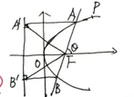

① $|PF|=x_0+\frac{p}{2}$，焦半径的范围$[\frac{p}{2},+\infty)$。

② $|AF|=\frac{p}{1-\cos\theta},\ |BF|=\frac{p}{1+\cos\theta}$，$|AB|=x_1+x_2+p=\frac{2p}{\sin^2\theta}$；
$\frac{1}{|AF|}+\frac{1}{|BF|}=\frac{2}{p}$；通径长为$2p$。

③ $S_{\triangle AOB}=\frac{p^2}{2\sin\theta}$。

④ $x_1x_2=\frac{p^2}{4},\ y_1y_2=-p^2$。

⑤ $\angle A'FB'=\frac{\pi}{2}$（$A',B'$为$A,B$在准线上的投影）。

⑥ 以$AB$为直径的圆与**准线**相切；

以$A'B'$为直径的圆与直线$AB$相切；

以$AF$为直径的圆与$y$轴相切。

⑦ $A',O,B$三点共线，$A,O,B'$三点共线；

延长$AO$交准线于点$B'$，则$BB'\parallel x$轴。

⑧ $\overrightarrow{OA}\cdot\overrightarrow{OB}=-\frac{3}{4}p^2$。

⑨ 相互垂直的焦点弦$AB,CD$：

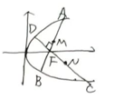

- $\frac{1}{|AB|}+\frac{1}{|CD|}=\frac{1}{2p}$；
- $|AB|+|CD|$的最小值为$8p$；
- $|AB|\cdot|CD|$的最小值为$16p^2$；
- 点$M,N$分别为$AB,CD$的中点，则$MN$过定点$(\frac{3p}{2},0)$；$S_{\triangle FMN}$的最小值为$p^2$。

⑩ 焦点弦$AB$的中垂线交$x$轴于$Q$，则$|FQ|=\frac{1}{2}|AB|$。

⑪ 由抛物线焦点发出的光线，经抛物线反射后，沿**平行于抛物线对称轴的方向射出**。

### 4. 直线与抛物线

① 直线与抛物线$y^2=2px(p>0)$交于$A,B$，若$OA\perp OB$，则直线过定点$(2p,0)$。

② 抛物线一弦的中点为$P(x_0,y_0)$，则$k_{弦}=\frac{p}{y_0}$。

③ 已知抛物线$C:y^2=2px(p>0)$，点$P(x_0,y_0)$：

- 若$P\in C$，则$P$处的切线方程为：$y_0y=p(x+x_0)$；
- 若$P\notin C$，则过$P$引抛物线的两条切线，切点弦所在直线方程为：$y_0y=p(x+x_0)$。

④ 已知抛物线$y^2=2px(p>0)$上两点$A(x_1,y_1),B(x_2,y_2)$，则$AB$方程为：$(y_1+y_2)y-y_1y_2=2px$。

⑤ 抛物线$x^2=2py(p>0)$，$l$为准线，$F$为焦点：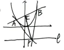

- 过准线上一点$P$作抛物线的两条切线，切点为$A,B$，则$AB$过$F$；
- $AB$过$F$交抛物线于$A,B$，分别过$A,B$作抛物线的切线交于$P$，则$P$在准线上；
- $AP\perp BP$；
- $PF\perp AB$；
- 点$P$的坐标为$(\frac{x_A+x_B}{2},-\frac{p}{2})$。

⑥ 直线与抛物线只有一个交点，则直线与抛物线**相切或相交**（相交时为平行于对称轴的直线）。

⑦ 过抛物线$C:y^2=2px(p>0)$外一点$P(x_0,y_0)$作$C$的两条切线，则切点弦所在直线方程为：$y_0y=p(x+x_0)$。

⑧ $A(x_1,y_1),B(x_2,y_2)$是$x^2=2py(p>0)$上任意两点，则$AB$方程为：$(x_1+x_2)x-x_1x_2=2py$。

⑨ 点$P(x_0,y_0)$是抛物线上一定点，$P_1,P_2$是抛物线上异于$P$的两动点，直线$PP_1,PP_2$的斜率存在且分别为$k_1,k_2$：

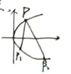

- 若$k_1+k_2=0\ (x_0\neq0)$，则直线$P_1P_2$的斜率为$-\frac{p}{y_0}$；
- 若$k_1+k_2=\lambda(\lambda\neq0)$，则直线$P_1P_2$过定点；
- 若$k_1k_2=\lambda(\lambda\neq0)$，则直线$P_1P_2$过定点。

### 5. 阿基米德三角形

$A(x_1,y_1),B(x_2,y_2)$是$y^2=2px(p>0)$上两点，以$A,B$为切点的两切线交于点$P(x_0,y_0)$，$M$为线段$AB$的中点，$Q$为线段$PM$的中点，$F$为抛物线的焦点：

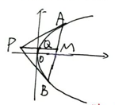

① 点$P$坐标为$(\frac{y_1y_2}{2p},\frac{y_1+y_2}{2})$；  
② $PM\parallel x$轴，即阿基米德三角形底边上的中线**平行于抛物线的对称轴**；  
③ $Q$在抛物线上，过$Q$作抛物线的切线，则该切线与$AB$平行；  
④ $S_{\triangle PAB}=\frac{|y_1-y_2|^3}{8p}$；  
⑤ $\angle PFA=\angle PFB$；  
⑥ $|PF|^2=|AF|\cdot|BF|$。

---

## 六、求轨迹方程

### 1. 直接法

步骤：建系设点 → 找关系列方程 → 化简整理 → 验证。

### 2. 定义法

- 适用于可判断出曲线类型的题；
- 一定要用定义作出判断，一定要用文字下结论；
- 双曲线要注意是一支还是两支。

易错示例：

① 平面上动点$P$到$F(4,0)$的距离比它到$y$轴的距离大4，则$P$的轨迹方程为：$y^2=16x\ (x\ge0)$ 或 $y=0\ (x<0)$；  
② 平面上动点$P$到$F(3,0)$的距离比它到$y$轴的距离大3，则$P$的轨迹方程为：$y^2=12(x-\frac{1}{2})$；  
③ 平面上动点$P$到$F(5,0)$的距离比它到$y$轴的距离大5，则$P$的轨迹方程为：$y^2=20(x+\frac{1}{2})\ (x\ge0)$ 或 $y^2=-2(x-\frac{9}{2})\ (x<0)$。

### 3. 相关点代入法

适用于所求点随另一个点的变动而变动，而另一个点在已知曲线上。

### 4. 消参法

---

## 七、圆锥与圆锥曲线

平面去截圆锥：

- 当**截面平行于圆锥底面**时，截面曲线为圆；
- 当**截面斜交圆锥**时，截面曲线为椭圆；
- 当**截面平行于圆锥的轴**时，截面曲线为双曲线的一支；
- 当**截面平行于圆锥母线**时，截面曲线为抛物线。
